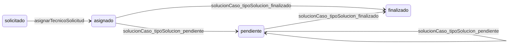

# Current Web & Backend Behavior v2 (MiAyudaTIC)

> Mobile ya no es “solo auth”. Estado canónico mobile: [`current-mobile-agent-context.md`](./current-mobile-agent-context.md).

Documento canónico basado en código. Cada `[Verificado]` incluye evidencia exacta. Sin propuestas de solución.

---

## 1. Executive snapshot

### Estado real del frontend web

- **[Verificado]** React 18 + Vite + TypeScript; routing con React Router v6.
  - **Archivo:** `client/package.json`
  - **Símbolo:** dependencias `react`, `vite`, `react-router-dom`
  - **Ruta/endpoint:** N/A (stack)
  - **Comportamiento:** cliente SPA compilado con Vite; no hay Next.js ni SSR.

- **[Verificado]** Autenticación de sesión vía cookie httpOnly + `verify-token` al boot.
  - **Archivo:** `client/src/shared/api/axios.ts`
  - **Símbolo:** `axiosConfig` (`withCredentials: true`)
  - **Ruta/endpoint:** `GET /api/auth/verify-token`
  - **Comportamiento:** todas las peticiones autenticadas envían cookie; no se guarda JWT en `localStorage`.

- **[Verificado]** Guards UI en tres capas: guest, autenticado, rol.
  - **Archivo:** `client/src/app/router/Allroutes.tsx`
  - **Símbolo:** `Allroutes`
  - **Ruta/endpoint:** rutas listadas en sección 2
  - **Comportamiento:** `GuestOnlyRoutes` bloquea auth pages si ya hay sesión; `PrivateRoutes` exige `isAuthenticated`; `RequireRole` restringe por `user.rol`.

### Estado real del backend

- **[Verificado]** API Express + MongoDB (Mongoose); montaje bajo `/api`.
  - **Archivo:** `server/src/core/app.ts`, `server/src/core/routes.ts`
  - **Símbolo:** `router`, `app.use('/api', router)`
  - **Ruta/endpoint:** prefijo `/api/*`
  - **Comportamiento:** features `auth`, `users`, `tickets`, `shared`; health en `/api/health` antes de CORS.

- **[Verificado]** RBAC por middleware `checkRol` en rutas; permisos a nivel recurso en algunos controllers.
  - **Archivo:** `server/src/shared/middleware/rol.ts`, `server/src/features/tickets/controllers/solicitud.ts`
  - **Símbolo:** `checkRol`, `getSolicitudId`
  - **Ruta/endpoint:** ej. `GET /api/solicitud/:id`
  - **Comportamiento:** funcionario solo ve sus solicitudes; técnico solo las asignadas a él.

### Qué ya está listo para mobile

- **[Verificado]** Auth REST con soporte Bearer explícito (además de cookie).
  - **Archivo:** `server/src/shared/utils/extractAuthToken.ts`
  - **Símbolo:** `extractAuthToken`
  - **Ruta/endpoint:** cualquier ruta con `authMiddleware`
  - **Comportamiento:** prioridad `Authorization: Bearer` → cookie `token` → socket handshake.

- **[Verificado]** Scaffold Expo con auth y cliente `apiFetch` + Bearer.
  - **Archivo:** `mobile/MiAyudaTIC-Mobile/src/shared/api/client.ts`
  - **Símbolo:** `apiFetch`
  - **Ruta/endpoint:** `/api/auth/login`, `/api/auth/verify-token`, etc.
  - **Comportamiento:** si `token` se pasa, setea `Authorization: Bearer ${token}`; no usa cookies.

- **[Verificado]** Paquete de contratos compartidos para eventos realtime.
  - **Archivo:** `packages/contracts/src/socket.ts`
  - **Símbolo:** `RealtimeEvents`
  - **Ruta/endpoint:** eventos `actualizarSolicitud`, `nuevaNotificacion`, etc.
  - **Comportamiento:** nombres de eventos tipados para socket.io.

### Qué no está listo para mobile

- **[Verificado]** App Expo no implementa flujos de tickets (solo auth).
  - **Archivo:** `mobile/MiAyudaTIC-Mobile/README.md`
  - **Símbolo:** N/A
  - **Ruta/endpoint:** N/A
  - **Comportamiento:** README describe solo welcome, login, registro, recuperación de contraseña.

- **[Riesgo / deuda]** Web no envía evidencia en resolución de caso aunque el backend la acepta.
  - **Archivo:** `client/src/features/tickets/api/solucion.service.ts`
  - **Símbolo:** `submitSolucionCaso`
  - **Ruta/endpoint:** `POST /api/solucionCaso/:id`
  - **Comportamiento:** envía JSON; no `multipart/form-data` con campo `evidencia`.

- **[Pendiente de verificación]** Push notifications (FCM/APNs): no hay código en backend ni mobile scaffold.

### Riesgos críticos para no romper web al extender backend

- **[Verificado]** Web asume objetos poblados en respuestas de solicitud (`usuario.nombre`, `ambiente.nombre`, `foto.url`).
  - **Archivo:** `client/src/pages/tecnico/CasosPorResolverTabla.tsx`
  - **Símbolo:** `CasosPorResolverTabla` (render de filas)
  - **Ruta/endpoint:** `GET /api/solicitud/asignadas`
  - **Comportamiento:** accede a `row.ambiente?.nombre`, `row.usuario.nombre`, `row.foto.url` sin defensas si faltan populate.

- **[Verificado]** Web depende de polling REST de notificaciones cada 30s.
  - **Archivo:** `client/src/features/notifications/hooks/useNotificaciones.ts`
  - **Símbolo:** `useNotificaciones`
  - **Ruta/endpoint:** `GET /api/notificaciones`
  - **Comportamiento:** `setInterval(..., 30000)`; no hay cliente socket en `client/`.

---

## 2. Web behavior actual

### Rutas existentes por rol

| Ruta web | Guard UI | Página | Rol esperado |
|---|---|---|---|
| `/loginMain`, `/login` | `GuestOnlyRoutes` | `LoginMain`, `JustLogin` | guest |
| `/register` | `GuestOnlyRoutes` | `RegisterLogin` | guest |
| `/forgot` | `GuestOnlyRoutes` | `ForgotPassword` | guest |
| `/restablecerPassword/:token` | `GuestOnlyRoutes` | `ResetPassword` | guest |
| `/perfil` | `PrivateRoutes` only | `Perfil` | cualquier autenticado |
| `/funcionario` | `RequireRole(['funcionario'])` | `Funcionario` | funcionario |
| `/casos-por-resolver` | `RequireRole(['tecnico'])` | `CasosPorResolverTabla` | tecnico |
| `/mis-casos` | `RequireRole(['tecnico'])` | `MisCasosTabla` | tecnico |
| `/casos-resueltos` | `RequireRole(['tecnico'])` | `CasosResueltosTabla` | tecnico |
| `/adminSolicitud` | `RequireRole(['lider'])` | `AdminSolicitud` | lider |
| `/adminTecnicos` | `RequireRole(['lider'])` | `AdminTecnicos` | lider |
| `/adminAmbientes` | `RequireRole(['lider'])` | `AdminAmbientes` | lider |
| `/adminCasos` | `RequireRole(['lider'])` | `AdminCasos` | lider |
| `/adminEstadisticas` | `RequireRole(['lider'])` | `AdminEstadisticas` | lider |
| `/tecnicosActivos` | `RequireRole(['lider'])` | `TecnicosActivos` | lider |
| `/tecnicosInactivos` | `RequireRole(['lider'])` | `TecnicosInactivos` | lider |
| `/seguimiento` | `RequireRole(['lider'])` | `SeguimientoSolicitud` | lider |

- **[Verificado]** Evidencia de guards:
  - **Archivo:** `client/src/app/router/Allroutes.tsx`
  - **Símbolo:** `Allroutes`
  - **Ruta/endpoint:** tabla arriba
  - **Comportamiento:** `RequireRole` redirige a `getRoleHome(user.rol)` si rol no coincide (`RequireRole.tsx` L19-20).

- **[Verificado]** `/perfil` no tiene `RequireRole`; cualquier usuario autenticado puede abrirla.
  - **Archivo:** `client/src/app/router/Allroutes.tsx`
  - **Símbolo:** `Allroutes` L39-40
  - **Ruta/endpoint:** `/perfil`
  - **Comportamiento:** solo exige `PrivateRoutes` (sesión válida).

### Qué puede hacer funcionario

- **[Verificado]** Crear solicitud con `FormData` (incluye campo `foto` si hay archivo seleccionado).
  - **Archivo:** `client/src/pages/funcionario/Funcionario.tsx`
  - **Símbolo:** `onSubmit`
  - **Ruta/endpoint:** `POST /api/solicitud`
  - **Comportamiento:** append `descripcion`, `telefono`, `ambiente`, `tipoCaso`, `usuario`, `foto`.

- **[Verificado]** Ver historial propio vía `GET /api/solicitud/historial`.
  - **Archivo:** `client/src/pages/funcionario/HistorialFuncionario.tsx`
  - **Símbolo:** `fetchHistorial`
  - **Ruta/endpoint:** `GET /api/solicitud/historial`
  - **Comportamiento:** lista en tabla con badges por `estado`.

### Qué puede hacer técnico

- **[Verificado]** Listar casos asignados no finalizados y resolver vía modal.
  - **Archivo:** `client/src/pages/tecnico/CasosPorResolverTabla.tsx`
  - **Símbolo:** `handleSubmit`, `getCasosAsignados`
  - **Ruta/endpoint:** `GET /api/solicitud/asignadas`, `POST /api/solucionCaso/:id`
  - **Comportamiento:** filtra `estado !== 'finalizado'` en cliente; envía `descripcionSolucion`, `tipoCaso`, `tipoSolucion`.

- **[Verificado]** Ver casos finalizados.
  - **Archivo:** `client/src/pages/tecnico/CasosResueltosTabla.tsx`
  - **Símbolo:** `getCasosFinalizados`
  - **Ruta/endpoint:** `GET /api/solicitud/finalizadas`
  - **Comportamiento:** carga historial de tickets con `estado: finalizado`.

### Qué puede hacer líder TIC

- **[Verificado]** Asignar técnico a solicitudes pendientes.
  - **Archivo:** `client/src/pages/admin/AdminSolicitud.tsx`
  - **Símbolo:** `handleAssignClick`
  - **Ruta/endpoint:** `GET /api/solicitud/pendientes`, `PUT /api/solicitud/:id/asignarTecnico`
  - **Comportamiento:** modal con técnicos aprobados; PUT con `{ tecnico: id }`.

- **[Verificado]** Gestionar técnicos pendientes, activos/inactivos, ambientes, tipos de caso, estadísticas.
  - **Archivo:** `AdminTecnicos.tsx`, `TecnicosActivos.tsx`, `AdminAmbientes.tsx`, `AdminCasos.tsx`, `AdminEstadisticas.tsx`
  - **Símbolo:** varios `useEffect` fetch
  - **Ruta/endpoint:** ver tabla “Endpoints por rol” abajo
  - **Comportamiento:** CRUD parcial según endpoints expuestos en services.

### Guards reales en UI

- **[Verificado]** `PrivateRoutes`: si `!isAuthenticated || !user` → `Navigate` a `/loginMain`.
  - **Archivo:** `client/src/app/router/private.routes.tsx`
  - **Símbolo:** `PrivateRoutes` L10
  - **Ruta/endpoint:** todas las rutas bajo `PrivateRoutes`
  - **Comportamiento:** muestra `Loaders` mientras `loading`.

- **[Verificado]** `RequireRole`: compara `user.rol.toLowerCase()` con lista permitida.
  - **Archivo:** `client/src/app/router/RequireRole.tsx`
  - **Símbolo:** `RequireRole` L18-20
  - **Ruta/endpoint:** rutas de rol en `Allroutes.tsx`
  - **Comportamiento:** redirect a home del rol, no a 403.

- **[Inferido]** Guards UI no sustituyen RBAC backend; un usuario puede llamar API directamente si tiene cookie/Bearer válido y rol correcto en servidor.

### Estados loading / error / empty

- **[Verificado]** Tablas usan `loading` spinner, `toast.error` en catch, empty state con copy fijo.
  - **Archivo:** `client/src/pages/tecnico/CasosPorResolverTabla.tsx`
  - **Símbolo:** render condicional `loading ? ... : currentItems.length > 0 ? ... : empty`
  - **Ruta/endpoint:** N/A
  - **Comportamiento:** errores vía `getApiErrorMessage` + `react-toastify`.

### Notificaciones en web

- **[Verificado]** Polling cada 30s; UI en `NavApp`.
  - **Archivo:** `client/src/features/notifications/hooks/useNotificaciones.ts`, `client/src/shared/ui/NavApp.tsx`
  - **Símbolo:** `useNotificaciones`, `NavApp`
  - **Ruta/endpoint:** `GET /api/notificaciones`, `PATCH /api/notificaciones/:id/leer`, `PATCH /api/notificaciones/leer-todas`
  - **Comportamiento:** cuenta `noLeidas` = `response.data.length`; muestra `notif.mensaje` y `notif.createdAt`.

- **[Verificado]** No hay cliente `socket.io` en el frontend web.
  - **Archivo:** `client/package.json` (sin dependencia socket.io)
  - **Símbolo:** N/A
  - **Ruta/endpoint:** N/A
  - **Comportamiento:** grep en `client/` sin matches de `socket`.

### Cómo se comporta auth en web

- **[Verificado]** Login: backend setea cookie; frontend guarda `user` en React context.
  - **Archivo:** `server/src/features/auth/controllers/auth.ts`, `client/src/features/auth/components/LoginForm.tsx`
  - **Símbolo:** `loginCtrl`, `onSubmit`
  - **Ruta/endpoint:** `POST /api/auth/login`
  - **Comportamiento:** `res.cookie('token', ...)` + `res.json({ dataUser })`; web llama `setUser`/`setIsAuthenticated`, no persiste token.

- **[Verificado]** 401 en respuestas API (excepto verify-token) dispara logout UX.
  - **Archivo:** `client/src/shared/api/axios.ts`, `client/src/features/auth/context/AuthContext.tsx`
  - **Símbolo:** interceptor response, `setUnauthorizedHandler`
  - **Ruta/endpoint:** cualquier `/api/*` con 401
  - **Comportamiento:** toast “sesión expiró” + navigate `/loginMain`.

### Qué partes están pulidas vs incompletas

- **[Verificado]** Flujos principales de listado/asignación/resolución tienen UI completa con tablas y modales.
  - **Archivo:** páginas en `client/src/pages/admin/`, `client/src/pages/tecnico/`, `client/src/pages/funcionario/`
  - **Símbolo:** componentes de página
  - **Ruta/endpoint:** ver tabla screen/flow en appendix
  - **Comportamiento:** paginación solo en cliente (`itemsPerPage`); sin paginación server-side.

- **[Riesgo / deuda]** `ResolutionModal` tiene input de imagen pero no se envía al backend.
  - **Archivo:** `client/src/features/tickets/components/ResolutionModal.tsx`, `client/src/features/tickets/api/solucion.service.ts`
  - **Símbolo:** `ResolutionModal`, `submitSolucionCaso`
  - **Ruta/endpoint:** `POST /api/solucionCaso/:id`
  - **Comportamiento:** preview local con `URL.createObjectURL`; POST solo JSON.

- **[Riesgo / deuda]** `Perfil` es solo lectura; no llama `GET/PUT /api/usuarios/perfil`.
  - **Archivo:** `client/src/pages/shared/Perfil.tsx`
  - **Símbolo:** `Perfil`
  - **Ruta/endpoint:** N/A (usa `useAuth().user`)
  - **Comportamiento:** muestra datos del contexto cargado por `verify-token`.

### Bugs / quirks conocidos vigentes

- **[Verificado]** Input foto en solicitud sin `required` en UI; `onSubmit` hace `append('foto', formData.foto[0])` sin guard.
  - **Archivo:** `client/src/pages/funcionario/Funcionario.tsx`
  - **Símbolo:** `onSubmit` L90, input L248
  - **Ruta/endpoint:** `POST /api/solicitud`
  - **Comportamiento:** si no hay archivo, puede enviar `undefined` en FormData.

- **[Verificado]** Tipo cliente `Notificacion` usa `leida`; backend usa `leido`.
  - **Archivo:** `client/src/shared/types/domain.ts`, `server/src/features/shared/models/notificaciones.ts`
  - **Símbolo:** `Notificacion`, `INotificacion`
  - **Ruta/endpoint:** `GET /api/notificaciones`
  - **Comportamiento:** UI no lee campo leído; solo `mensaje` y `createdAt`.

- **[Verificado]** Respuesta historial funcionario usa key `solicitudesFinalizadas` pero query no filtra por finalizado.
  - **Archivo:** `server/src/features/tickets/controllers/solicitud.ts`
  - **Símbolo:** `historialSolicitudesCreadas`
  - **Ruta/endpoint:** `GET /api/solicitud/historial`
  - **Comportamiento:** `find({ usuario: usuarioId })` sin filtro de estado.

- **[Verificado]** Tipo `SolicitudEstado` en cliente omite `'pendiente'` aunque UI y backend lo usan.
  - **Archivo:** `client/src/shared/types/domain.ts` L40
  - **Símbolo:** `SolicitudEstado`
  - **Ruta/endpoint:** N/A
  - **Comportamiento:** union type `'solicitado' | 'asignado' | 'finalizado'`; badges en `HistorialFuncionario` incluyen `pendiente`.

### Endpoints que consume la web hoy, por rol

| Rol | Método | Endpoint | Service | Página(s) |
|---|---|---|---|---|
| guest | POST | `/api/auth/login` | `auth.service.ts` | `LoginForm` |
| guest | POST | `/api/auth/register` | `auth.service.ts` | `RegisterForm` |
| guest | POST | `/api/recuperarPassword` | `ForgotPasswordForm` | `ForgotPassword` |
| guest | POST | `/api/restablecerPassword/:token` | `auth.service.ts` | `ResetPassword` |
| todos auth | GET | `/api/auth/verify-token` | `auth.service.ts` | `AuthContext` |
| todos auth | POST | `/api/auth/logout` | `auth.service.ts` | `NavApp` |
| todos auth | GET | `/api/notificaciones` | `notifications.service.ts` | `NavApp` |
| todos auth | PATCH | `/api/notificaciones/:id/leer` | `notifications.service.ts` | `NavApp` |
| todos auth | PATCH | `/api/notificaciones/leer-todas` | `notifications.service.ts` | `NavApp` |
| funcionario | GET | `/api/ambienteFormacion` | `solicitud.service.ts` | `Funcionario` |
| funcionario | GET | `/api/tipoCaso` | `solicitud.service.ts` | `Funcionario` |
| funcionario | POST | `/api/solicitud` | `solicitud.service.ts` | `Funcionario` |
| funcionario | GET | `/api/solicitud/historial` | `solicitud.service.ts` | `Funcionario`, `HistorialFuncionario` |
| tecnico | GET | `/api/solicitud/asignadas` | `solicitud.service.ts` | `CasosPorResolverTabla`, `MisCasosTabla` |
| tecnico | GET | `/api/solicitud/finalizadas` | `solicitud.service.ts` | `CasosResueltosTabla` |
| tecnico | GET | `/api/tipoCaso` | `solicitud.service.ts` | `CasosPorResolverTabla` |
| tecnico | POST | `/api/solucionCaso/:id` | `solucion.service.ts` | `CasosPorResolverTabla` |
| lider | GET | `/api/solicitud/pendientes` | `solicitud.service.ts` | `AdminSolicitud` |
| lider | PUT | `/api/solicitud/:id/asignarTecnico` | `solicitud.service.ts` | `AdminSolicitud` |
| lider | GET | `/api/solicitud/historialSolicitudes` | `solicitud.service.ts` | `SeguimientoSolicitud` |
| lider | GET | `/api/tecnicos/tecnicosPendientes` | `tecnicos.service.ts` | `AdminTecnicos` |
| lider | PUT | `/api/tecnicos/:id/aprobarTecnico` | `tecnicos.service.ts` | `AdminTecnicos` |
| lider | PUT | `/api/tecnicos/:id/denegarTecnico` | `tecnicos.service.ts` | `AdminTecnicos` |
| lider | GET | `/api/tecnicos/tecnicosAprobados` | `tecnicos.service.ts` | `AdminSolicitud` |
| lider | GET | `/api/usuarios/activos` | `tecnicos.service.ts` | `TecnicosActivos` |
| lider | GET | `/api/usuarios/inactivos` | `tecnicos.service.ts` | `TecnicosInactivos` |
| lider | PUT | `/api/usuarios/:id/inactivar` | `tecnicos.service.ts` | `TecnicosActivos` |
| lider | PUT | `/api/usuarios/:id/reactivar` | `tecnicos.service.ts` | `TecnicosInactivos` |
| lider | GET | `/api/ambienteFormacion` | `ambiente.service.ts` | `AdminAmbientes` |
| lider | POST | `/api/ambienteFormacion` | `ambiente.service.ts` | `AdminAmbientes` |
| lider | PUT | `/api/ambienteFormacion/:id` | `ambiente.service.ts` | `AdminAmbientes` |
| lider | PUT | `/api/ambienteFormacion/:id/inactivar` | `ambiente.service.ts` | `AdminAmbientes` |
| lider | GET | `/api/tipoCaso` | `solicitud.service.ts` | `AdminCasos` |
| lider | POST | `/api/tipoCaso` | `solicitud.service.ts` | `AdminCasos` |
| lider | PUT | `/api/tipoCaso/:id` | `solicitud.service.ts` | `AdminCasos` |
| lider | GET | `/api/graficaSolicitudesPorAmbiente?year=` | `estadisticas.service.ts` | `AdminEstadisticas` |
| lider | GET | `/api/graficaSolicitudesPorMes?year=` | `estadisticas.service.ts` | `AdminEstadisticas` |

### Endpoints backend existentes que la web NO consume hoy

`GET /api/solicitud`, `GET /api/solicitud/:id`, `DELETE /api/solicitud/:id`, `GET /api/usuarios`, `GET /api/usuarios/perfil`, `PUT /api/usuarios/perfil`, `GET /api/usuarios/:id`, `GET /api/ambienteFormacion/:id`, `GET /api/tipoCaso/:id`, `DELETE /api/tipoCaso/:id`, `GET/POST/PUT/DELETE /api/storage`, `GET /api/media/local/:filename`, `POST /api/media/upload`.

---

## 3. Backend behavior actual

### Módulos / feature folders reales

```
server/src/features/
  auth/       → login, register, password recovery
  users/      → usuarios, tecnicos
  tickets/    → solicitud, solucionCaso, tipoCaso, gráficas
  shared/     → ambienteFormacion, notificaciones, storage, media
```

- **[Verificado]** Montaje en router central.
  - **Archivo:** `server/src/core/routes.ts`
  - **Símbolo:** `router`
  - **Ruta/endpoint:** `/api/*`
  - **Comportamiento:** importa y `router.use` por dominio.

### Flujo de estados de solicitud



- **[Verificado]** Estados en schema: `solicitado`, `asignado`, `pendiente`, `finalizado`.
  - **Archivo:** `server/src/features/tickets/models/solicitud.ts`
  - **Símbolo:** `solicitudSchema` campo `estado`
  - **Ruta/endpoint:** N/A
  - **Comportamiento:** enum L55; default `solicitado`.

- **[Verificado]** `solucionCaso` solo permite resolver si estado ∈ `['asignado', 'pendiente']`.
  - **Archivo:** `server/src/features/tickets/controllers/solucionCaso.ts`
  - **Símbolo:** `solucionCaso`
  - **Ruta/endpoint:** `POST /api/solucionCaso/:id`
  - **Comportamiento:** 409 si estado inválido o ya `finalizado`; `tipoSolucion: 'pendiente'` setea `solicitud.estado = 'pendiente'`.

- **[Verificado]** Cada POST solución crea nuevo documento `SolucionCaso` y actualiza puntero `solicitud.solucion`.
  - **Archivo:** `server/src/features/tickets/controllers/solucionCaso.ts`
  - **Símbolo:** `solucionCasoModel.create`, `findByIdAndUpdate`
  - **Ruta/endpoint:** `POST /api/solucionCaso/:id`
  - **Comportamiento:** múltiples registros `pendiente` posibles; bloquea segundo `finalizado` si `solicitud.solucion` ya existe (L44-47). **Solo tickets legacy v1.** Tickets `workflowVersion: 2` usan acciones v2 + `HistorialSolicitud`, no `SolucionCaso`.

### Workflow v2 (código actual, no migrado)

- **Decisión:** `workflowVersion` ausente = v1; `2` = flujo nuevo. Altas nuevas: `estado: 'nuevo'`.
- **Estados v2:** `nuevo`, `asignado`, `en_progreso`, `esperando_usuario`, `resuelto`, `cerrado`, `cancelado`.
- **List vs detalle:** listas nunca llevan `historial`. Detalle y `GET /api/solicitud/:id/historial` usan `historialLimit` / `historialBefore` / `historialNextCursor`.
- **Idempotency-Key:** header obligatorio. Sin key → 400 `IDEMPOTENCY_KEY_REQUIRED`. El servidor no genera UUID. Índice unique sparse solo vía migrate, no autoIndex. Clientes: una UUID por intención; retry automático de mutaciones v2 = 0; CTA manual `Reintentar acción` reutiliza key y payload. Login retry permanece aparte.
- **Atomicidad:** producción exige transacciones + índice; si faltan, no arranca workflow v2. Standalone local = update + insert con rollback condicionado a `workflowRevision` + `lastWorkflowOperationId`.
- **E2E remoto:** sin deploy, Render actual no valida v2. No bloquear el reporte solo en `e2e/.env.e2e`.
- **Contrato canónico:** `docs/contracts.md` y skill `ticket-lifecycle`.

### Auth real: cookie, bearer, socket

- **[Verificado]** Orden de extracción de token.
  - **Archivo:** `server/src/shared/utils/extractAuthToken.ts`
  - **Símbolo:** `extractAuthToken`
  - **Ruta/endpoint:** HTTP + Socket handshake
  - **Comportamiento:** Bearer → cookie → `handshake.auth.token`.

- **[Verificado]** Cookie auth: httpOnly, secure en prod, sameSite `none` en prod.
  - **Archivo:** `server/src/shared/utils/cookieOptions.ts`
  - **Símbolo:** `getAuthCookieOptions`
  - **Ruta/endpoint:** `POST /api/auth/login`
  - **Comportamiento:** `maxAge` 2h (alineado con `JWT_EXPIRES_IN_SECONDS`).

- **[Verificado]** Socket.io autentica en middleware y une a room `user:{userId}`.
  - **Archivo:** `server/src/shared/utils/handleSocket.ts`
  - **Símbolo:** `io.use`, `io.on('connection')`
  - **Ruta/endpoint:** WebSocket
  - **Comportamiento:** emite `RealtimeEvents.CONNECTION_ACK` al conectar.

### RBAC real por endpoint

Ver tabla completa en Appendix. Patrón: `authMiddleware` + `checkRol([...])` en rutas.

### Resource-level permissions

- **[Verificado]** `GET /api/solicitud/:id`: funcionario solo propias; técnico solo asignadas.
  - **Archivo:** `server/src/features/tickets/controllers/solicitud.ts`
  - **Símbolo:** `getSolicitudId`
  - **Ruta/endpoint:** `GET /api/solicitud/:id`
  - **Comportamiento:** 403 si `usuario._id` o `tecnico._id` no coincide.

- **[Verificado]** `POST /api/solucionCaso/:id`: técnico debe ser el asignado.
  - **Archivo:** `server/src/features/tickets/controllers/solucionCaso.ts`
  - **Símbolo:** `solucionCaso` L26-29
  - **Ruta/endpoint:** `POST /api/solucionCaso/:id`
  - **Comportamiento:** compara `solicitud.tecnico` con `req.usuario._id`.

- **[Verificado]** Notificaciones: solo el dueño puede marcar leída.
  - **Archivo:** `server/src/features/shared/controllers/notificaciones.ts`
  - **Símbolo:** `marcarComoLeida`
  - **Ruta/endpoint:** `PATCH /api/notificaciones/:id/leer`
  - **Comportamiento:** 403 si `notificacion.usuario !== userId`.

### Uploads / evidencias

- **[Verificado]** Foto solicitud: opcional en schema; obligatoria solo si `REQUIRE_SOLICITUD_FOTO === 'true'`.
  - **Archivo:** `server/src/shared/config/media.ts`, `server/src/features/tickets/controllers/solicitud.ts`
  - **Símbolo:** `isSolicitudFotoRequired`, `crearSolicitud`
  - **Ruta/endpoint:** `POST /api/solicitud`
  - **Comportamiento:** acepta `file` multer o `body.fotoId`; error 400 si flag activo y sin foto.

- **[Verificado]** Evidencia solución: opcional en schema y controller (`if (file)`).
  - **Archivo:** `server/src/features/tickets/models/solucionCaso.ts`, `server/src/features/tickets/controllers/solucionCaso.ts`
  - **Símbolo:** `evidencia`, `solucionCaso`
  - **Ruta/endpoint:** `POST /api/solucionCaso/:id` campo `evidencia`
  - **Comportamiento:** guarda vía `saveUploadedFile(file, 'evidencias')` si hay archivo.

- **[Verificado]** Storage dual Cloudinary / disco local.
  - **Archivo:** `server/src/shared/services/mediaStorage.ts`
  - **Símbolo:** `saveUploadedFile`
  - **Ruta/endpoint:** uploads en solicitud, solución, perfil, storage, media
  - **Comportamiento:** si `isCloudinaryEnabled()` → `uploadToCloudinary`; si no → `saveToLocalDisk`.

- **[Verificado]** Producción exige Cloudinary configurado al boot.
  - **Archivo:** `server/src/shared/config/env.ts`
  - **Símbolo:** `validateEnvOnBoot`
  - **Ruta/endpoint:** N/A
  - **Comportamiento:** `NODE_ENV === 'production' && !isCloudinaryEnabled()` → throw Error.

- **[Verificado]** Health reporta modo storage.
  - **Archivo:** `server/src/core/health.ts`
  - **Símbolo:** `healthCheck`
  - **Ruta/endpoint:** `GET /api/health`
  - **Comportamiento:** `integrations.cloudinary: 'configured' | 'local'`.

### Notificaciones persistidas + realtime

- **[Verificado]** `GET /api/notificaciones` devuelve solo `leido: false` del usuario.
  - **Archivo:** `server/src/features/shared/controllers/notificaciones.ts`
  - **Símbolo:** `getNotificaciones`
  - **Ruta/endpoint:** `GET /api/notificaciones`
  - **Comportamiento:** `find({ usuario, leido: false }).sort({ createdAt: -1 })`.

- **[Verificado]** Eventos socket definidos en contratos.
  - **Archivo:** `packages/contracts/src/socket.ts`
  - **Símbolo:** `RealtimeEvents`
  - **Ruta/endpoint:** `actualizarSolicitud`, `actualizarTecnico`, `nuevaNotificacion`, `connection:ack`
  - **Comportamiento:** payloads tipados en mismo archivo.

- **[Verificado]** Emisión en asignación y resolución.
  - **Archivo:** `server/src/shared/services/realtime.ts`, controllers `solicitud.ts` / `solucionCaso.ts`
  - **Símbolo:** `emitSolicitudUpdate`, `emitNotificacion`, `emitTecnicoUpdate`
  - **Ruta/endpoint:** N/A (socket)
  - **Comportamiento:** `emitToUser(userId, event, payload)` → room `user:{userId}`.

### Gráficas / estadísticas

- **[Verificado]** Agregaciones por ambiente y por mes; query `year` opcional.
  - **Archivo:** `server/src/features/tickets/controllers/graficaSolicitudesPorAmbiente.ts`
  - **Símbolo:** `getSolicitudesPorAmbientes`
  - **Ruta/endpoint:** `GET /api/graficaSolicitudesPorAmbiente?year=`
  - **Comportamiento:** pipeline MongoDB `$match` por rango de fechas del año.

### Endpoints sensibles vs seguros

- **[Verificado]** Mutaciones de estado validan precondiciones (estado actual, técnico asignado, cuenta activa).
  - **Archivo:** `server/src/features/tickets/controllers/solicitud.ts`, `solucionCaso.ts`, `server/src/shared/middleware/accountStatus.ts`
  - **Símbolo:** `asignarTecnicoSolicitud`, `solucionCaso`, `assertAccountActive`
  - **Ruta/endpoint:** PUT asignar, POST solución
  - **Comportamiento:** 409 en transiciones inválidas; 401/403 en auth/RBAC.

- **[Riesgo / deuda]** `DELETE /api/solicitud/:id` es hard delete sin evidencia de cascada en código revisado.
  - **Archivo:** `server/src/features/tickets/controllers/solicitud.ts`
  - **Símbolo:** `deleteSolicitud`
  - **Ruta/endpoint:** `DELETE /api/solicitud/:id`
  - **Comportamiento:** `findByIdAndDelete`; web no lo usa.

### Backward-compatible vs frágil

- **[Verificado]** Respuestas de listas de solicitud pasan por `enrichSolicitudList` → añade `foto.optimizedUrl` en backend.
  - **Archivo:** `server/src/shared/utils/enrichMediaResponse.ts`
  - **Símbolo:** `enrichSolicitudList`, `enrichStorageRecord`
  - **Ruta/endpoint:** GET solicitudes varios
  - **Comportamiento:** web usa `foto.url`, no `optimizedUrl` (grep vacío en client).

- **[Verificado]** Formato de `fecha` en solicitud transformado a string `dd-MM-yyyy HH:mm` en `toJSON`.
  - **Archivo:** `server/src/features/tickets/models/solicitud.ts`
  - **Símbolo:** `toJSON.transform`
  - **Ruta/endpoint:** respuestas con solicitud
  - **Comportamiento:** web ordena por `new Date(b.fecha)` en `AdminSolicitud` — depende de parseo JS.

- **[Frágil]** Keys de respuesta inconsistentes: `data` vs `solicitudesAsignadas` vs `solicitudesFinalizadas` vs `tecnicosFalse`.
  - **Archivo:** controllers + `client/src/features/*/api/*.ts`
  - **Símbolo:** varios
  - **Ruta/endpoint:** múltiples GET
  - **Comportamiento:** cada service conoce la key exacta; cambiar shape rompe web.

### Estructuras enriquecidas de las que depende la web

| Campo / shape | Dónde se produce | Dónde consume web |
|---|---|---|
| `usuario` poblado `{ nombre }` | `.populate('usuario', 'nombre')` en controllers solicitud | tablas admin/técnico búsqueda y display |
| `ambiente` poblado `{ nombre }` | `.populate('ambiente', 'nombre')` | `Funcionario`, tablas técnico |
| `foto` poblado `{ url, filename? }` + enrich | `populate('foto')` + `enrichSolicitudList` | thumbnails `row.foto.url` |
| `solucion` poblado `{ descripcionSolucion, evidencia }` | populate en finalizadas/historial | `CasosResueltosTabla` (si renderiza solución) |
| `tecnicos` / `tecnicosFalse` en respuestas técnicos | controllers técnicos | `AdminSolicitud`, `AdminTecnicos` |

---

## 4. Cross-surface contract reality

### Qué consume web hoy del backend

- **[Verificado]** REST JSON + `multipart/form-data` solo en `POST /api/solicitud`.
  - **Archivo:** `client/src/features/tickets/api/solicitud.service.ts`
  - **Símbolo:** `crearSolicitud`
  - **Ruta/endpoint:** `POST /api/solicitud`
  - **Comportamiento:** `Content-Type: multipart/form-data`.

- **[Verificado]** Sesión por cookie httpOnly; sin header Bearer en web.
  - **Archivo:** `client/src/shared/api/axios.ts`
  - **Símbolo:** `axiosConfig`
  - **Ruta/endpoint:** todas las llamadas web autenticadas
  - **Comportamiento:** `withCredentials: true`; interceptor no añade Authorization.

### Qué asume la web que NO se debe romper

- Populate de refs en solicitudes (ver tabla sección 3).
- Keys de respuesta por endpoint (tabla sección 2).
- Cookie de sesión con nombre `token` y CORS `credentials: true` (`server/src/core/app.ts`).

### Campos / flows invariantes

- **[Verificado]** Roles: `funcionario`, `tecnico`, `lider` (enum usuario).
  - **Archivo:** `server/src/features/users/models/usuarios.ts`
  - **Símbolo:** `usuarioSchema` campo `rol`
  - **Ruta/endpoint:** N/A
  - **Comportamiento:** únicos roles válidos en DB.

- **[Verificado]** Flujo ticket: `solicitado` → `asignado` → (`pendiente` opcional, repetible) → `finalizado`.
  - **Archivo:** controllers solicitud + solucionCaso
  - **Símbolo:** ver diagrama sección 3
  - **Ruta/endpoint:** PUT asignar, POST solución
  - **Comportamiento:** asignación solo desde `solicitado`.

### Extensión segura para mobile vs versionado

- **[Inferido]** Agregar campos opcionales en JSON de respuesta es seguro si no se eliminan existentes.
- **[Verificado]** Paginación server-side no existe; web pagina en memoria — mobile con listas grandes necesitaría contrato nuevo o aceptar carga completa.
  - **Archivo:** `client/src/pages/tecnico/CasosPorResolverTabla.tsx` (`itemsPerPage = 5`, slice local)
  - **Símbolo:** paginación cliente
  - **Ruta/endpoint:** GET listas sin query `page`
  - **Comportamiento:** backend devuelve array completo.

### Mobile scaffold vs web

| Aspecto | Web | Expo scaffold |
|---|---|---|
| Auth transport | Cookie | Bearer header |
| Register foto | JSON sin foto (`RegisterForm`) | FormData opcional si `fotoUri` (`registerRequest`) |
| Tickets | Implementado | No implementado |
| Notificaciones | Polling REST | No implementado |
| Socket | No | No |

---

## 5. Mobile readiness from current system

### Qué necesita Expo para comenzar ya (según código existente)

- **[Verificado]** `EXPO_PUBLIC_API_URL` apuntando al backend.
  - **Archivo:** `mobile/MiAyudaTIC-Mobile/src/shared/api/client.ts`
  - **Símbolo:** `getApiBaseUrl`
  - **Ruta/endpoint:** base `/api`
  - **Comportamiento:** throw si env vacía.

- **[Verificado]** Persistencia de token para Bearer (scaffold tiene `src/shared/storage/token.ts`).
  - **Archivo:** `mobile/MiAyudaTIC-Mobile/src/features/auth/api.ts`
  - **Símbolo:** `verifyTokenRequest(token)`
  - **Ruta/endpoint:** `GET /api/auth/verify-token`
  - **Comportamiento:** pasa token explícito en header.

### Qué ya existe y puede reutilizarse

- Backend REST completo con RBAC.
- `@miayuda/contracts` para eventos socket.
- Scaffold auth screens en `mobile/MiAyudaTIC-Mobile/app/(auth)/`.

### Gaps que impiden flujos mobile completos

- Sin pantallas ni API client para solicitud/solución/notificaciones en Expo.
- Sin integración socket en mobile scaffold.
- Sin push notifications en código.

### Flutter legacy (`mobile_flutter/MBO_ULT`)

- **[Inferido]** Pantallas legacy: `home_funcionario_screen.dart`, `form_request_screen.dart`, `home_tecnico_screen.dart`, `informe_request_screen.dart` — referencia UX únicamente.
  - **Archivo:** `mobile_flutter/MBO_ULT/lib/screens/`
  - **Símbolo:** archivos listados
  - **Ruta/endpoint:** N/A
  - **Comportamiento:** no comparte código con monorepo v1.0 web/backend; no debe tratarse como contrato API.

- **[Verificado]** No modificar Flutter legacy para extender backend web — carpetas separadas sin imports cruzados al server actual.

---

## 6. Suggested handoff to mobile strategy

### Inputs para Founding Mobile Engineer

- Este documento v2 + tabla endpoint del appendix.
- Credenciales de prueba por rol (no en repo; crear en entorno dev).
- Contratos socket en `packages/contracts/src/socket.ts`.
- Ejemplo Bearer: `mobile/MiAyudaTIC-Mobile/src/shared/api/client.ts`.

### Decisiones para Founder-CTO

- Política de foto obligatoria en solicitud (`REQUIRE_SOLICITUD_FOTO` en prod).
- Si mobile MVP incluye líder (scaffold tiene `lider-not-supported.tsx` en `app/(auth)/`).
- Estrategia de notificaciones: polling vs socket vs push (ninguna implementada en mobile hoy).

### Contratos a revisar por PE2

- Keys de respuesta por endpoint (tabla appendix).
- `POST /api/solucionCaso/:id`: JSON vs multipart evidencia.
- `GET /api/solicitud/historial` naming vs contenido real.
- Paginación futura sin romper web.

### UX invariants para Design Engineer

- Mapeo estados → badges (web: Solicitado, Asignado, En Proceso=`pendiente`, Completado=`finalizado`).
  - **Archivo:** `client/src/pages/funcionario/HistorialFuncionario.tsx` `getStatusBadge`
- Flujo confirmación antes de enviar solicitud (modal en `Funcionario.tsx`).
- Resolución técnico: campos descripción, tipo caso, tipo solución (`ResolutionModal`).

---

## Claims corrected from v1

| claim anterior (v1) | estado final | evidencia | corrección |
|---|---|---|---|
| Foto de solicitud es obligatoria | Condicional / no validada en UI | `media.ts` `isSolicitudFotoRequired`; `Funcionario.tsx` L248 sin `required`; schema `foto` optional | Solo obligatoria si env `REQUIRE_SOLICITUD_FOTO=true`. Web siempre intenta append foto sin validar. |
| Storage es solo local | Dual; prod exige Cloudinary | `mediaStorage.ts` L116-120; `env.ts` L13-16 | Dev puede usar disco; prod boot falla sin Cloudinary. |
| Uploads guardados localmente y servidos por `/api/media/local` | Parcial | `saveToLocalDisk` vs `uploadToCloudinary`; `health.ts` reporta modo | En prod con Cloudinary, URLs son `res.cloudinary.com`. Ruta local solo si storage local activo. |
| Técnico adjunta evidencia en web | UI sí, envío no | `ResolutionModal.tsx` file input; `solucion.service.ts` JSON only | Backend acepta `evidencia` multipart; web no lo envía. |
| Auth web guarda token cookie o body | Cookie httpOnly primaria | `auth.ts` `res.cookie`; `LoginForm` no guarda token; `axios` `withCredentials` | Body incluye token en login response pero web no lo usa para requests. |
| Web usa polling para notificaciones | Confirmado | `useNotificaciones.ts` interval 30s; sin socket en client | v1 correcto; reforzado con evidencia. |
| Flujo incluye estado `pendiente` | Confirmado | `solicitud.ts` enum; `solucionCaso.ts` transición; UI badges | `pendiente` es estado de ticket y valor de `tipoSolucion`. |
| Guards en todas rutas sensibles | Parcial | `Allroutes.tsx`: `/perfil` sin `RequireRole` | Rutas de rol protegidas; perfil abierto a cualquier autenticado. API sigue con RBAC. |
| Web depende de enrich exacto | Parcial | `enrichMediaResponse.ts`; web usa `foto.url` no `optimizedUrl` | Depende de populate + `url`; enrich añade campo no consumido por web. |
| Register web con foto | Incorrecto en práctica | `auth.ts` route `uploadMiddleware.single('foto')`; `RegisterForm` POST JSON vía `registerService` | Backend soporta foto en registro; web actual no envía multipart. |
| `GET /api/solicitud` usado por web | No | grep client: no consumption of `GET /` solicitud | Web usa `/pendientes`, `/historial`, etc. |
| Tipo `SolicitudEstado` incluye pendiente | No en types cliente | `domain.ts` L40 vs `HistorialFuncionario` L70 | Desalineación types vs runtime. |

---

## Do not assume for mobile strategy

1. **Valor de `REQUIRE_SOLICITUD_FOTO` en Render/prod** — solo existe lógica en código; no hay `.env` de prod en repo.
2. **Cloudinary efectivamente configurado en deploy actual** — boot lo exige en prod, pero no hay smoke test automático en CI contra prod.
3. **Push notifications (FCM/APNs)** — cero implementación en backend y mobile scaffold.
4. **Paridad Flutter → Expo** — pantallas legacy no verificadas contra API v1.0 actual.
5. **Paginación backend** — no implementada; asumir arrays completos.
6. **Múltiples `SolucionCaso` por ticket** — backend permite varios `pendiente`; historial de soluciones intermedias no expuesto en web.
7. **Web enviará evidencia en resolución** — hoy no lo hace; no asumir paridad UI/backend.
8. **Socket en web próximamente** — no hay código cliente; polling es el único canal web verificado.
9. **Líder en mobile MVP** — existe pantalla `lider-not-supported.tsx`; alcance mobile para líder no definido en código.
10. **Campo `leida` en notificaciones** — tipo cliente incorrecto; backend usa `leido`.
11. **Cold start Render** — mencionado en mobile README (30–60s); no verificado en este repo contra entorno live.
12. **Registro técnico auto-login** — backend no devuelve token si `rol === 'tecnico'` (`registerCtrl` L61-63).

---

## 7. Appendix

### Tabla endpoint por endpoint

| endpoint | método | RBAC backend | quién lo usa hoy | web depende | mobile podría | riesgo romper | notas |
|---|---|---|---|---|---|---|---|
| `/api/health` | GET | público | nadie (probe) | no | sí | bajo | antes de CORS |
| `/api/auth/register` | POST | público + rate limit | web, mobile | sí | sí | medio | multipart foto opcional |
| `/api/auth/login` | POST | público + rate limit | web, mobile | sí | sí | alto | setea cookie + body token |
| `/api/auth/verify-token` | GET | token | web, mobile | sí | sí | alto | devuelve user poblado |
| `/api/auth/logout` | POST | cookie/token | web, mobile | sí | sí | medio | limpia cookie |
| `/api/recuperarPassword` | POST | público + limiter | web, mobile | sí | sí | bajo | |
| `/api/restablecerPassword/:token` | POST | público + limiter | web, mobile | sí | sí | bajo | |
| `/api/usuarios` | GET | lider | nadie | no | sí | bajo | |
| `/api/usuarios/perfil` | GET | todos | nadie | no | sí | medio | web usa verify-token |
| `/api/usuarios/perfil` | PUT | todos + foto | nadie | no | sí | medio | actualizar perfil |
| `/api/usuarios/activos` | GET | lider | web | sí | sí | medio | |
| `/api/usuarios/inactivos` | GET | lider | web | sí | sí | medio | |
| `/api/usuarios/:id` | GET | lider | nadie | no | sí | bajo | |
| `/api/usuarios/:id/inactivar` | PUT | lider | web | sí | sí | medio | |
| `/api/usuarios/:id/reactivar` | PUT | lider | web | sí | sí | medio | |
| `/api/tecnicos/tecnicosPendientes` | GET | lider | web | sí | no | medio | key `tecnicosFalse` |
| `/api/tecnicos/tecnicosAprobados` | GET | lider | web | sí | no | medio | key `tecnicos` |
| `/api/tecnicos/:id/aprobarTecnico` | PUT | lider | web | sí | no | medio | |
| `/api/tecnicos/:id/denegarTecnico` | PUT | lider | web | sí | no | medio | |
| `/api/solicitud` | GET | lider | nadie | no | sí | medio | todas las solicitudes |
| `/api/solicitud/historialSolicitudes` | GET | lider | web | sí | sí | medio | excluye `solicitado` |
| `/api/solicitud/pendientes` | GET | lider | web | sí | sí | alto | key `data` |
| `/api/solicitud/asignadas` | GET | tecnico | web | sí | sí | alto | key `solicitudesAsignadas` |
| `/api/solicitud/finalizadas` | GET | tecnico | web | sí | sí | alto | key `solicitudesFinalizadas` |
| `/api/solicitud/historial` | GET | funcionario | web | sí | sí | alto | key misleading |
| `/api/solicitud` | POST | funcionario | web | sí | sí | alto | multipart foto |
| `/api/solicitud/:id` | GET | todos* | nadie | no | sí | medio | *resource check |
| `/api/solicitud/:id` | DELETE | lider | nadie | no | sí | alto | hard delete |
| `/api/solicitud/:id/asignarTecnico` | PUT | lider | web | sí | no | alto | solo estado solicitado |
| `/api/solucionCaso/:id` | POST | tecnico | web | sí | sí | alto | JSON en web; multipart en API |
| `/api/tipoCaso` | GET | todos | web | sí | sí | medio | |
| `/api/tipoCaso/:id` | GET | todos | nadie | no | sí | bajo | |
| `/api/tipoCaso` | POST | lider | web | sí | no | medio | |
| `/api/tipoCaso/:id` | PUT | lider | web | sí | no | medio | |
| `/api/tipoCaso/:id` | DELETE | lider | nadie | no | no | medio | |
| `/api/graficaSolicitudesPorAmbiente` | GET | lider | web | sí | no | bajo | query year |
| `/api/graficaSolicitudesPorMes` | GET | lider | web | sí | no | bajo | query year |
| `/api/ambienteFormacion` | GET | lider, funcionario | web | sí | sí | medio | |
| `/api/ambienteFormacion/:id` | GET | lider, funcionario | nadie | no | sí | bajo | |
| `/api/ambienteFormacion` | POST | lider | web | sí | no | medio | |
| `/api/ambienteFormacion/:id` | PUT | lider | web | sí | no | medio | |
| `/api/ambienteFormacion/:id/inactivar` | PUT | lider | web | sí | no | medio | |
| `/api/notificaciones` | GET | auth | web | sí | sí | alto | solo no leídas |
| `/api/notificaciones/:id/leer` | PATCH | auth | web | sí | sí | medio | owner check |
| `/api/notificaciones/leer-todas` | PATCH | auth | web | sí | sí | medio | |
| `/api/storage` | GET/POST | lider | nadie | no | no | bajo | admin storage |
| `/api/storage/:id` | GET | todos | nadie | no | sí | bajo | |
| `/api/storage/:id` | PUT/DELETE | lider | nadie | no | no | bajo | |
| `/api/media/local/:filename` | GET | auth | nadie** | no | sí | medio | **indirecto vía foto.url |
| `/api/media/upload` | POST | auth | nadie | no | sí | medio | upload genérico |

### Tabla screen / flow por rol en web

| Rol | Ruta | Página | Acciones UI principales | Endpoints |
|---|---|---|---|---|
| guest | `/loginMain` | Login | login | POST login |
| guest | `/register` | Register | registro funcionario/técnico | POST register |
| guest | `/forgot` | ForgotPassword | recuperar | POST recuperarPassword |
| guest | `/restablecerPassword/:token` | ResetPassword | nueva clave | POST restablecerPassword |
| all | `/perfil` | Perfil | ver datos (read-only) | ninguno (context) |
| funcionario | `/funcionario` | Funcionario | crear solicitud, ver stats | POST solicitud, GET historial, GET ambientes/tipos |
| funcionario | (component) | HistorialFuncionario | tabla historial | GET historial |
| tecnico | `/casos-por-resolver` | CasosPorResolverTabla | resolver caso | GET asignadas, POST solucionCaso |
| tecnico | `/mis-casos` | MisCasosTabla | ver asignados | GET asignadas |
| tecnico | `/casos-resueltos` | CasosResueltosTabla | historial resueltos | GET finalizadas |
| lider | `/adminSolicitud` | AdminSolicitud | asignar técnico | GET pendientes, PUT asignar |
| lider | `/seguimiento` | SeguimientoSolicitud | historial líder | GET historialSolicitudes |
| lider | `/adminTecnicos` | AdminTecnicos | aprobar/denegar | GET tecnicosPendientes, PUT aprobar/denegar |
| lider | `/tecnicosActivos` | TecnicosActivos | inactivar | GET activos, PUT inactivar |
| lider | `/tecnicosInactivos` | TecnicosInactivos | reactivar | GET inactivos, PUT reactivar |
| lider | `/adminAmbientes` | AdminAmbientes | CRUD ambientes | GET/POST/PUT ambienteFormacion |
| lider | `/adminCasos` | AdminCasos | CRUD tipos caso | GET/POST/PUT tipoCaso |
| lider | `/adminEstadisticas` | AdminEstadisticas | gráficas | GET gráficas |

### Tabla de eventos / notificaciones actuales

| Acción | Notificación DB | Socket event | Email | Evidencia |
|---|---|---|---|---|
| Crear solicitud | No | No | Sí → funcionario | `crearSolicitud` `sendMail` |
| Asignar técnico | Sí → funcionario | `actualizarSolicitud`, `nuevaNotificacion`, `actualizarTecnico` → técnico | Sí → técnico | `asignarTecnicoSolicitud` |
| Resolver caso (pendiente/finalizado) | Sí → funcionario | `actualizarSolicitud`, `nuevaNotificacion` | Sí → funcionario si finalizado | `solucionCaso` |
| Login / logout | No | No | No | — |
| Aprobar técnico | No | No | Sí → técnico | `tecnicos.ts` `aprobarTecnico` `sendMail` |
| Denegar técnico | No | No | Sí → técnico | `tecnicos.ts` `denegarTecnico` `sendMail` + hard delete usuario |

---

## Surface confidence matrix

| surface | behavior | evidence source | confidence |
|---|---|---|---|
| Web auth (cookie) | Sesión vía httpOnly cookie + verify-token boot | `axios.ts`, `auth.ts` controller, `AuthContext.tsx` | high |
| Web auth (Bearer) | No usa Bearer en cliente web | `axios.ts` (sin Authorization header) | high |
| Mobile auth (Bearer) | Login + verify con token en header | `mobile/.../client.ts`, `auth/api.ts` | high |
| Solicitud create (backend) | Foto opcional salvo env flag; ambiente activo requerido | `solicitud.ts` controller, `media.ts` | high |
| Solicitud create (web UI) | FormData con foto sin validación required | `Funcionario.tsx` | high |
| Storage prod | Cloudinary requerido en boot prod | `env.ts`, `mediaStorage.ts` | high |
| Storage dev | Fallback disco local si Cloudinary off | `mediaStorage.ts`, `health.ts` | high |
| Estado `pendiente` | Estado ticket + tipoSolucion | `solicitud.ts` model, `solucionCaso.ts` | high |
| Solución evidencia (API) | Multipart opcional campo `evidencia` | `solucionCaso.ts` route + controller | high |
| Solución evidencia (web) | No enviada | `solucion.service.ts`, `ResolutionModal.tsx` | high |
| Route guards UI | RequireRole en rutas de rol; /perfil solo PrivateRoutes | `Allroutes.tsx`, `RequireRole.tsx` | high |
| RBAC API | checkRol + resource checks | `rol.ts`, controllers | high |
| Notificaciones web | Polling 30s REST | `useNotificaciones.ts` | high |
| Socket backend | Auth + rooms + emit helpers | `handleSocket.ts`, `realtime.ts` | high |
| Socket web | Ausente | `client/package.json`, grep client | high |
| Enriched responses | populate + enrich; web usa `.url` | `enrichMediaResponse.ts`, tablas web | high |
| Historial funcionario key | `solicitudesFinalizadas` = todas | `historialSolicitudesCreadas` | high |
| REQUIRE_SOLICITUD_FOTO en prod | Desconocido valor deploy | solo `media.ts` lógica | low |
| Push notifications | No existe | ausencia en repo | high |
| Flutter UX parity | 8 pantallas legacy | `mobile_flutter/MBO_ULT/lib/screens/` | low |
| Email en aprobar/denegar técnico | Sí, sin notif DB ni socket | `tecnicos.ts` `aprobarTecnico`, `denegarTecnico` | high |
| Múltiples soluciones pendientes UX | Backend permite; web no muestra historial | `solucionCaso.ts` model + controller | medium |

---

*Generado desde código en `MiAyudaTics_v1.0/`. v1 permanece en `context/current-web-backend-behavior.md` sin modificar.*
