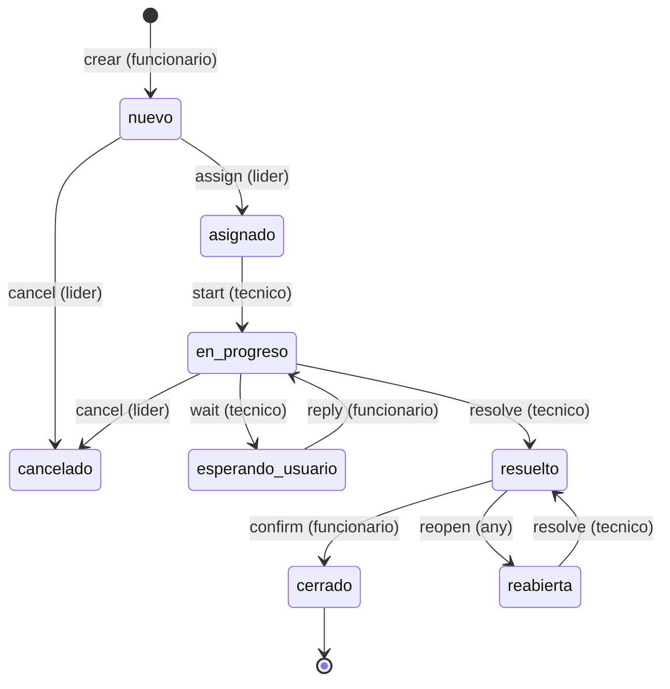

# MiAyudaTIC - Agent Context (Optimized)

## Project Identity (1 paragraph)

MiAyudaTIC is a feature-based monorepo originally created to replace paper and WhatsApp support workflows in SENA technical training centers with a unified, software-based, workflow v2 state machine engine (atomic transactions, idempotency keys, 6-state RBAC matrix isolation, append-only audit log). It supports parallel delivery surfaces: Web (React 18 + Vite + TypeScript + Tailwind) + PWA Mobile (same codebase with phone detection + Service Worker + Manifest), all communicating with a central API (Express 5 + MongoDB Atlas + Zod + JWT dual extractor) deployed on Render and Firebase Hosting. An Expo/React Native app exists but is archived and not the production mobile strategy.

## Repository Structure (compact)

```
miayudatic/
  docs/canonical/     # This document + canonical reference
  client/             # Web React 18 + Vite + TypeScript + PWA + Mobile phone detection
  server/             # API Express 5 + Mongoose 8 + TypeScript + Feature-based
  mobile/             # Expo 56 + React Native app (archived, not production deployment)
  packages/contracts/ # Shared Zod schemas (@miayuda/contracts)
```

## Current HEAD

- SHA: a61cde32b3131c4e6d3be284afb6d5eb2aa5d566
- Date: 2026-10-10 (Sat Oct 10 2026)
- Tag: v2.0.0-backend-ts-migration
- Meaning: Backend TypeScript migration closed; workflow v2 engine landed; PWA implemented; production operational
- Uncommitted: client/public/version.json, client/src/pages/loginMain/LoginMain.tsx
- Branch status: develop branch is 22 commits behind master (entire QA running pre-PWA codebase)

## Architecture (200 words)

MiAyudaTIC is a feature-based monorepo with loosely coupled components. Web (React 18 / Vite / TypeScript) and PWA Mobile (same codebase with `usePhoneLayout` triple detection) deliver UI over a shared API (Express 5 / Mongoose 8). API serves JWT via dual extraction (Cookie for web/PWA, Bearer for native) and enforces role isolation (funcionario/tecnico/lider) with middleware guards (403 verboten). Workflow v2 engine (commit 48a67f8f) is the heart: pure lifecycle state machine + orchestrator + idempotency (operationId + payloadHash) + transactions (Atlas) / compensating (local) + append-only event log (14 types). Realtime is Server-Sent Events (SSE) for web push with 60s poll fallback. Contracts are shared Zod schemas in packages/contracts/@miayuda/contracts. Deploys: Render Docker (backend), Firebase Hosting (prod+qa web). Production mobile strategy: PWA with Service Worker v7, Manifest standalone mode, triple mobile detection, and 7 dedicated phone UI components in `client/src/features/auth/phone/`. An Expo/React Native app exists in `mobile/` as archived work but is not the production deployment.

## Critical Files (Must Understand)

| File | Surface | Responsibility |
|------|--------|---------------|
| server/src/features/solicitud-lifecycle.ts | API | Pure state machine / role isolation matrix / transition guards
| server/src/features/solicitud-workflow.ts | API | Orchestrator I/O + transactions + historia append + SSE emit + email dispatch, returns dedup token X-Dedup-Token
| server/src/features/workflow-idempotency.ts | API | Deduplication logic (unique index) + conflict 403 HTTP response
| server/src/features/workflow-atomicity.ts | API | Runtime decision: Atlas transactions vs local compensating logic
| server/middleware/extractAuthToken.ts | API | Dual extraction (Cookie bearer) extractor; extracts JWT from either cookie or Authorization header
| client/src/features/auth/phone/usePhoneLayout.ts | PWA | Mobile detection triple strategy (UA + viewport + touch)
| client/src/features/auth/phone/PhoneChrome.tsx | PWA | Phone UI base components and design tokens
| client/src/features/auth/phone/PhoneWelcome.tsx | PWA | Mobile landing screen
| client/src/features/auth/phone/PhoneLogin.tsx | PWA | Mobile-optimized login flow
| client/src/features/auth/phone/PhoneRegister.tsx | PWA | Mobile registration flow
| client/public/sw.js | PWA | Service Worker v7: hybrid caching (network-first HTML, cache-first assets)
| client/public/manifest.json | PWA | Manifest: standalone display, SENA theme, portrait orientation, app shortcuts
| client/src/shared/pwa/PWAInstallPrompt.tsx | PWA | Role-aware install prompt (mobile)
| client/public/offline.html | PWA | Branded offline page
| mobile/libs/offline/offline-store.ts | Expo | Offline queue (JSONL) + auto sync (archived work)
| mobile/libs/session/session.ts | Expo | SessionStatus 6-state auth machine (archived work)

## Workflow v2 Quick Reference



## Key Invariants (NEVER Violate)

1. Role column isolation: funcionario/tecnico/lider strict RBAC via JWT+403 guards; never allow unauthorized state transition
2. Idempotency: operationId + payloadHash unique -> 403 Conflict on duplicate
3. Historial append-only: never delete events from HistorialSolicitud
4. Dual extraction: always check Cookie THEN Authorization header for JWT across all endpoints
5. V1/V2 coexistence: guard, always wrap legacy calls in `isLegacyWorkflow(s)` 
6. ConsecutivoCaso: ensure unique `codigoCaso` via sequence generator before persistence
7. SSE safe fallback: keep 60s poll fallback + gracefully degrade if SSE unavailable

## What NOT to Do

- Do NOT delete `HistorialSolicitud` events (append-only principle)
- Do NOT bypass `extractAuthToken(req)` dual extractor pattern
- Do NOT assume SSE always works across CDNs; keep 60s poll fallback
- Do NOT commit Expo push private keys, Firebase admin SDK config, or private cryptographic material
- Do NOT rename paths without updating `packages/contracts/` schemas and redeploy both surfaces
- Do NOT drop `workflowVersion` guard without a or yen zero-coexistence migration run on Atlas
- Do NOT promise realtime mobile push; production PWA has no push implementation; SSE works only when app is open; Expo has offline queue but is not the production mobile strategy

## Where Documentation Lives (Agent Entry Points)

| File | Purpose |
|------|---------|
| docs/canonical/README_ROOT.md | Root README (single page quick start reference translated; wrap links but no deep text)
| docs/canonical/PROJECT_OVERVIEW.md | Value proposition + high-level evolution + three mobile strategies note
| docs/canonical/ARCHITECTURE.md | System topology, responsibilities, all API routes, auth, database, realtime, deployment, pWA contract
| docs/canonical/ENGINEERING_HISTORY.md | 6 phases with SHAs + key decisions + workflow v1->v2 evolution
| docs/canonical/WORKFLOW_V2.md | Workflow v2 deep reference: state machine, idempotency, atomicity, V1/V2 coexistence, safety props, CV bullets
| docs/canonical/CONTRIBUTIONS_AND_EVIDENCE.md | Evidence per claim; CV bullets ready vs qualify; interview talking points (then January run verify Git provenance script to confirm HEAD)
| docs/canonical/KNOWN_LIMITATIONS.md | Known issues: I2 open, I3 partially fixed, TD-04 deferred, validity unsure ISO 6 phases; uses priority table for triage
| docs/canonical/ONBOARDING.md | Local run commands, key files, add endpoint guide, add workflow action guide, test commands, troubleshooting
| docs/canonical/AGENT_CONTEXT.md | this file - optimized for AI entry point

## Required Project Config

Tip: Always check `git status`, `git log --oneline -5`, and `git diff` before any code modification; never stage credit without explicit request. Never commit from agent tools.