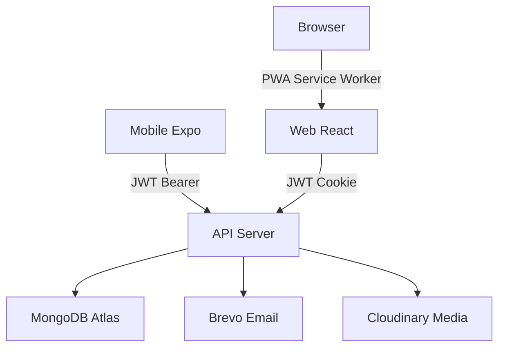
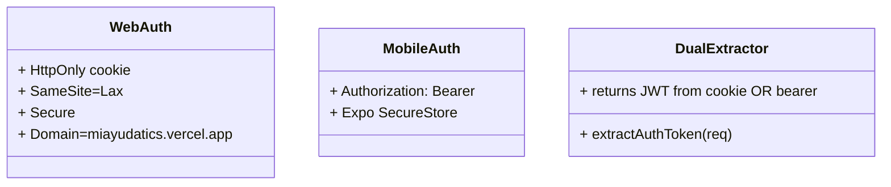
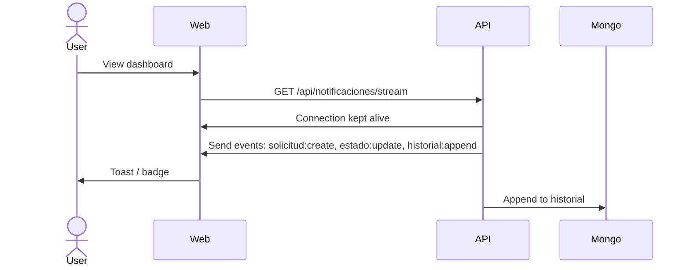
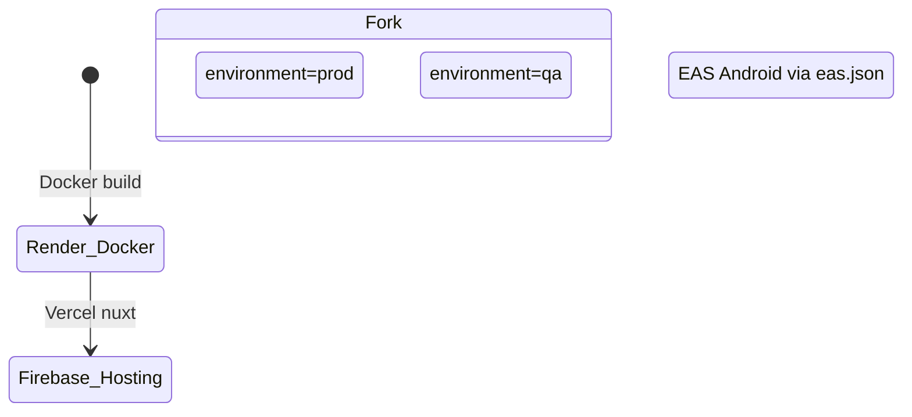
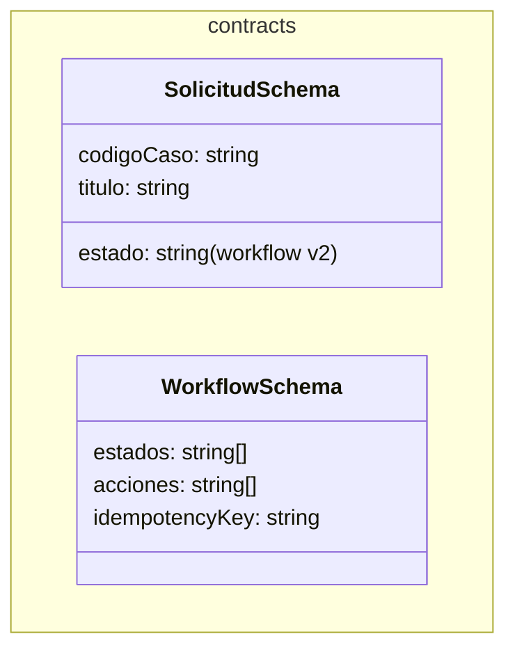
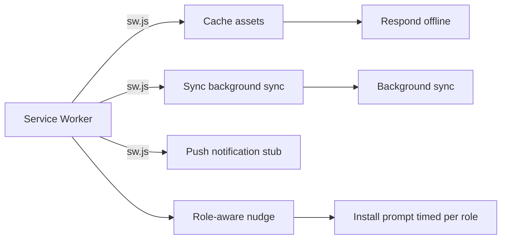

# MiAyudaTIC - System Architecture

## System Topology

## Component Responsibilities

| Component | Responsibility | Location |
|-----------|----------------|----------|
| **Web Client** | Feature-based UI + PWA + Auth via JWT in HttpOnly cookie | `client/` |
| **API Server** | Auth + RBAC + Workflow v2 + Events broadcast | `server/` |
| **Mobile App** | Offline queue + file-backed persistence + Auth via JWT Bearer | `mobile/` |
| **Contracts** | Shared Zod schemas (mean-closed DS>TSs) | `packages/contracts/` |

## All API Routes (confirmed from evidence)

| Method | Route | Auth | Role | Purpose |
|--------|-------|------|------|---------|
| POST | `/api/auth/login` | ✅ | all | JWT login (cookie/web, bearer/mobile) |
| POST | `/api/auth/register` | ❌ | none | Funcionario registration |
| POST | `/api/recuperarPassword` | ❌ | none | Email reset link |
| POST | `/api/restablecerPassword/:token` | ❌ | none | Complete password reset |
| GET | `/api/auth/verify-token` | ✅ | all | Current user profile |
| GET | `/api/notificaciones/stream` | ✅ | all | SSE event stream |
| GET | `/api/notificaciones/poll` | ✅ | all | Poll fallback |
| POST | `/api/solicitud` | ✅ | funcionario | Create solicitud (flow v2) |
| GET | `/api/solicitud` | ✅ | all | List solicitudes (role filtered) |
| GET | `/api/solicitud/:id` | ✅ | stakeholder | Detail + historial |
| PUT | `/api/solicitud/:id/asignarTecnico` | ✅ | lider | Assign to técnico |
| PUT | `/api/solicitud/:id/reasignarTecnico` | ✅ | lider | Reassign |
| POST | `/api/solicitud/:id/iniciarAtencion` | ✅ | tecnico | Start work |
| POST | `/api/solicitud/:id/solicitarInformacion` | ✅ | tecnico | Await requester reply |
| POST | `/api/solicitud/:id/actualizacion` | ✅ | tecnico | Update |
| POST | `/api/solicitud/:id/responder` | ✅ | funcionario | Requester reply |
| POST | `/api/solicitud/:id/solucionTotal` | ✅ | tecnico | Mark resolved |
| POST | `/api/solicitud/:id/confirmarSolucion` | ✅ | funcionario | Confirm solved |
| POST | `/api/solicitud/:id/reabrir` | ✅ | all | Reopen |
| POST | `/api/solicitud/:id/cancelar` | ✅ | lider | Cancel |
| GET | `/api/consecutivoCaso` | ✅ | lider | Consecutive counter |
| POST | `/api/storage` | ✅ | all | Upload file |

## Authentication Architecture

- **Dual token extraction**: `extractAuthToken(req)` checks cookie header first (`Cookie: jwt=...`), falls back to Authorization header (`Authorization: Bearer ...`)
- **Mobile storage**: Expo SecureStore with `commitMobileSession` pattern
- **Session states**: 6 states handled by `SessionStatus`
- **Líder restriction**: Mobile routes block líder role

## Database Models

| Model | Fields | Purpose |
|-------|--------|---------|
| **Usuario** | tipoRol, email, passwordHash, modalidad, estado, codigo, nombres, apellidos, telefono, dependencia, sede, documento, documentoTipo,ohoto, fechaEstborn, fechaCreated, fechaUpdated, sessionActive, sessionExpiry | User profile and auth |
| **Solicitud** | codigoCaso, titulo, descripcion, solicitante, tecnico, lider, ambiente,asos, equipo, prioridad, estado, prioridadPrioridad, workflowVersion, createdAt | Case request |
| **HistorialSolicitud** | solicitudId, solicitante, tecnico, lider, tipo_enEvent, detalles, metadata, workflowIdempotencyKey, createdAt | Append-only event log (14 types) |
| **SolucionCaso** | solicitudId, respuesta, usuarioId, createdAt (legacy) | (LEGACY FLOW) Photos/plantillas |
| **TipoCaso** | camino, nombre, descripcion | Case category |
| **AmbienteFormacion** | nombre, descripcion, sede | Learning environment |
| **Storage** | name, url, type, caseId, createdAt | Media uploads |
| **ConsecutivoCaso** | ultimoCodigo, fechaGeneracion | Auto-increment counter |

## Realtime Strategy

**SSE (Server-Sent Events)** — Primary realtime channel.

- **In-memory broadcaster**: No Redis dependency
- **60s poll fallback**: Web PWA uses SSE → falls to poll after 60s
- **No mobile client**: Mobile uses offline queue, no live SSE
- **Horizontal scale limit**: SSE broadcaster is in-memory → requires Redis Pub/Sub to scale horizontally (TD-04)

## Deployment Architecture

- **Backend**: Render.com Docker (vars `ENV लगीत versioning`) → `miayudatics-v1-0.onrender.com`
- **Frontend**: Firebase Hosting vercel.app/cwl (prod+qa targets) → `miayudatics.vercel.app`
- **Mobile**: Expo EAS builds (Android) → distributed via APK/IPA
- **CI/CD**: GitHub Actions (3 workflows: ci, deploy-qa-render, post-deploy-smoke)

## Contracts Package

- Shared schemas in `packages/contracts/` → published as `@miayuda/contracts`
- Used by both **server** and **mobile**
- Enforces consistency across surfaces

## PWA Architecture

- **Service worker**: `client/public/sw.js`
- **Manifest**: `manifest.json`
- **Install prompt**: Role-aware ( unresponsive after 5s idle web )
- **No mobile push**: Native mobile has separate push stub, not PWA push

## Key Files

| File | Responsibility |
|------|---------------|
| `server/src/features/solicitud-lifecycle.ts` | Pure state machine |
| `server/src/features/solicitud-workflow.ts` | Orchestrator (transactions) |
| `server/src/features/workflow-idempotency.ts` | OperationId + payloadHash dedup |
| `server/src/features/workflow-atomicity.ts` | Transactions vs compensating logic |
| `mobile/app/(flows)/solicitudes/...` | Mobile flows (auth, create, list, detail) |
| `client/src/pages/loginMain/LoginMain.tsx` | Web auth flow |
| `mobile/libs/offline/offline-store.ts` | TECNICO offline queue |
| `server/src/middleware/extractAuthToken.ts` | Dual extraction (cookie + bearer) |
| `server/src/app.ts` | SSE broadcaster setup |
