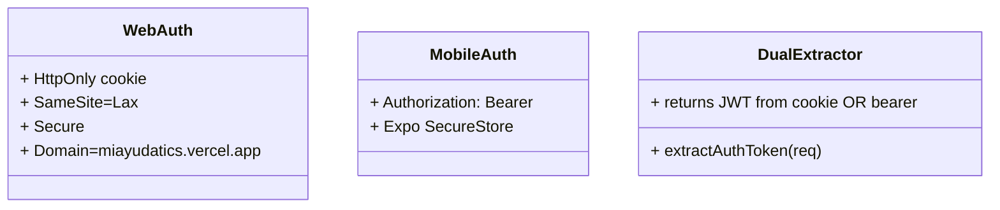
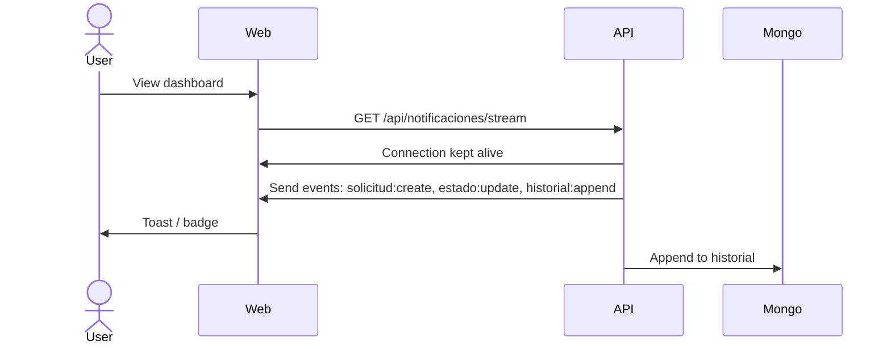
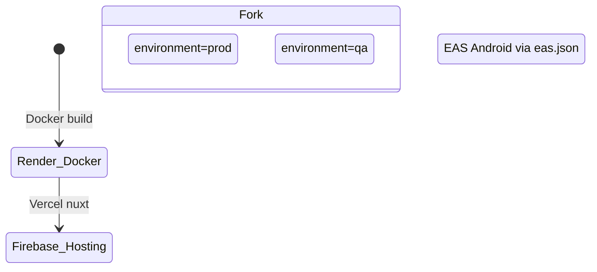
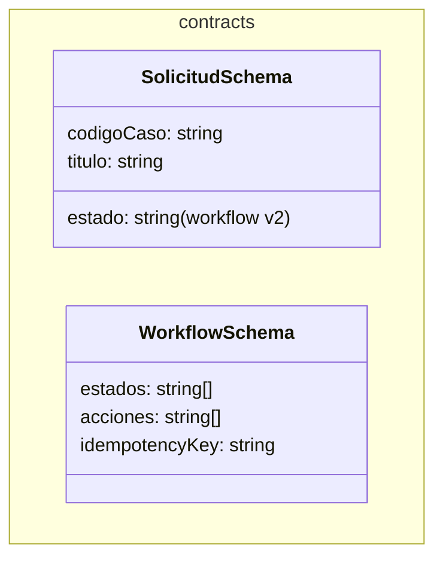
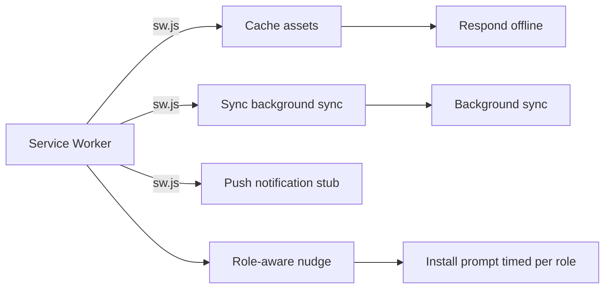

# MiAyudaTIC - System Architecture

## System Topology

```mermaid
graph TD
  A[Mobile PWA] -->|JWT Cookie| B[API Server]
  C[Web React] -->|JWT Cookie| B[API Server]
  B --> D[MongoDB Atlas]
  B --> E[Brevo Email]
  B --> F[Cloudinary Media]
  G[Browser] -->|PWA Service Worker| C[Web React]
  H[Mobile Expo] -->|JWT Bearer| B[API Server]
  style H fill:#f9f、 stroke:#9f9f9f、 stroke-width:2px、 stroke-dasharray: 5 5
```

Note: Mobile PWA is the **production** mobile strategy. Expo app exists but is not actively deployed.

## Component Responsibilities

| Component | Responsibility | Location |
|-----------|----------------|----------|
| **Web Client + PWA Mobile** | Feature-based UI + PWA + Phone detection + Auth via JWT in HttpOnly cookie | `client/` |
| **API Server** | Auth + RBAC + Workflow v2 + Events broadcast | `server/` |
| **Expo App** | Offline queue + file-backed persistence + Auth via JWT Bearer | `mobile/` |
| **Contracts** | Shared Zod schemas (mean-closed DS>TSs) | `packages/contracts/` |

## All API Routes (confirmed from evidence)

| Method | Route | Auth | Role | Purpose |
|--------|-------|------|------|---------|
| POST | `/api/auth/login` | ✅ | all | JWT login (cookie/web, bearer/mobile) |
| POST | `/api/auth/register` | ❌ | none | Funcionario registration |
| POST | `/api/recuperarPassword` | ❌ | none | Email reset link |
| POST | `/api/restablecerPassword/:token` | ❌ | none | Complete password reset |
| GET | `/api/auth/verify-token` | ✅ | all | Current user profile |
| GET | `/api/notificaciones/stream` | ✅ | all | SSE event stream |
| GET | `/api/notificaciones/poll` | ✅ | all | Poll fallback |
| POST | `/api/solicitud` | ✅ | funcionario | Create solicitud (flow v2) |
| GET | `/api/solicitud` | ✅ | all | List solicitudes (role filtered) |
| GET | `/api/solicitud/:id` | ✅ | stakeholder | Detail + historial |
| PUT | `/api/solicitud/:id/asignarTecnico` | ✅ | lider | Assign to técnico |
| PUT | `/api/solicitud/:id/reasignarTecnico` | ✅ | lider | Reassign |
| POST | `/api/solicitud/:id/iniciarAtencion` | ✅ | tecnico | Start work |
| POST | `/api/solicitud/:id/solicitarInformacion` | ✅ | tecnico | Await requester reply |
| POST | `/api/solicitud/:id/actualizacion` | ✅ | tecnico | Update |
| POST | `/api/solicitud/:id/responder` | ✅ | funcionario | Requester reply |
| POST | `/api/solicitud/:id/solucionTotal` | ✅ | tecnico | Mark resolved |
| POST | `/api/solicitud/:id/confirmarSolucion` | ✅ | funcionario | Confirm solved |
| POST | `/api/solicitud/:id/reabrir` | ✅ | all | Reopen |
| POST | `/api/solicitud/:id/cancelar` | ✅ | lider | Cancel |
| GET | `/api/consecutivoCaso` | ✅ | lider | Consecutive counter |
| POST | `/api/storage` | ✅ | all | Upload file |

## Authentication Architecture



- **Dual token extraction**: `extractAuthToken(req)` checks cookie header first (`Cookie: jwt=...`), falls back to Authorization header (`Authorization: Bearer ...`)
- **Mobile storage**: PWA uses HttpOnly cookies, Expo uses SecureStore with `commitMobileSession` pattern
- **Session states**: 6 states handled by `SessionStatus` (Expo), PWA uses web JWT cookie pattern
- **Líder restriction**: Expo mobile routes block líder role; PWA uses responsive design for all roles

## Database Models

| Model | Fields | Purpose |
|-------|--------|---------|
| **Usuario** | tipoRol, email, passwordHash, modalidad, estado, codigo, nombres, apellidos, telefono, dependencia, sede, documento, documentoTipo,ohoto, fechaEstborn, fechaCreated, fechaUpdated, sessionActive, sessionExpiry | User profile and auth |
| **Solicitud** | codigoCaso, titulo, descripcion, solicitante, tecnico, lider, ambiente,asos, equipo, prioridad, estado, prioridadPrioridad, workflowVersion, createdAt | Case request |
| **HistorialSolicitud** | solicitudId, solicitante, tecnico, lider, tipo_enEvent, detalles, metadata, workflowIdempotencyKey, createdAt | Append-only event log (14 types) |
| **SolucionCaso** | solicitudId, respuesta, usuarioId, createdAt (legacy) | (LEGACY FLOW) Photos/plantillas |
| **TipoCaso** | camino, nombre, descripcion | Case category |
| **AmbienteFormacion** | nombre, descripcion, sede | Learning environment |
| **Storage** | name, url, type, caseId, createdAt | Media uploads |
| **ConsecutivoCaso** | ultimoCodigo, fechaGeneracion | Auto-increment counter |

## Realtime Strategy

**SSE (Server-Sent Events)** — Primary realtime channel.



- **In-memory broadcaster**: No Redis dependency
- **60s poll fallback**: Web PWA uses SSE → falls to poll after 60s
- **No mobile client**: Mobile uses offline queue, no live SSE
- **Horizontal scale limit**: SSE broadcaster is in-memory → requires Redis Pub/Sub to scale horizontally (TD-04)

## Deployment Architecture



- **Backend**: Render.com Docker (vars `ENV लगीत versioning`) → `miayudatics-v1-0.onrender.com`
- **Frontend**: Firebase Hosting vercel.app/cwl (prod+qa targets) → `miayudatics.vercel.app`
- **Mobile**: PWA installed via browser (Chrome Safari) → deployed at `miayudatics.web.app` (Expo app exists but not in production)
- **CI/CD**: GitHub Actions (3 workflows: ci, deploy-qa-render, post-deploy-smoke)

## Contracts Package



- Shared schemas in `packages/contracts/` → published as `@miayuda/contracts`
- Used by **server**, **web client**, and **Expo mobile**
- Enforces consistency across surfaces; PWA client uses web contracts via React

## PWA Architecture



- **Service worker**: `client/public/sw.js` v7 with hybrid caching (network-first HTML/API, cache-first hashed assets)
- **Manifest**: `client/public/manifest.json` with SENA branding, standalone display, portrait orientation, and app shortcuts
- **Mobile detection**: `client/src/features/auth/phone/usePhoneLayout.ts` (triple detection: UA + viewport + touch)
- **Phone UI components**: 7 components in `client/src/features/auth/phone/` (Chrome, Welcome, Login, Register, Forgot, ResetPassword)
- **Install prompt**: `client/src/shared/pwa/PWAInstallPrompt.tsx` for mobile + desktop nudge in LoginMain
- **Offline page**: `client/public/offline.html` with branded offline experience
- **Auto-update**: Service Worker checks `version.json` every 5 minutes and triggers auto-reload

## Key Files

| File | Responsibility |
|------|---------------|
| `server/src/features/solicitud-lifecycle.ts` | Pure state machine |
| `server/src/features/solicitud-workflow.ts` | Orchestrator (transactions) |
| `server/src/features/workflow-idempotency.ts` | OperationId + payloadHash dedup |
| `server/src/features/workflow-atomicity.ts` | Transactions vs compensating logic |
| `client/src/features/auth/phone/usePhoneLayout.ts` | Mobile device detection (triple strategy) |
| `client/src/features/auth/phone/PhoneChrome.tsx` | Phone UI base components and design system |
| `client/src/features/auth/phone/PhoneWelcome.tsx` | Mobile landing screen |
| `client/src/features/auth/phone/PhoneLogin.tsx` | Mobile-optimized login flow |
| `client/src/features/auth/phone/PhoneRegister.tsx` | Mobile registration flow |
| `client/public/sw.js` | Service Worker v7 with hybrid caching strategy |
| `client/public/manifest.json` | PWA manifest with standalone mode and SENA branding |
| `client/src/shared/pwa/PWAInstallPrompt.tsx` | PWA install prompt (role-aware) |
| `client/public/offline.html` | Branded offline page |
| `mobile/app/(flows)/solicitudes/...` | Expo mobile flows (archived, not production) |
| `mobile/libs/offline/offline-store.ts` | Expo TECNICO offline queue (archived) |
| `server/src/middleware/extractAuthToken.ts` | Dual extraction (cookie + bearer) |
| `server/src/app.ts` | SSE broadcaster setup |
