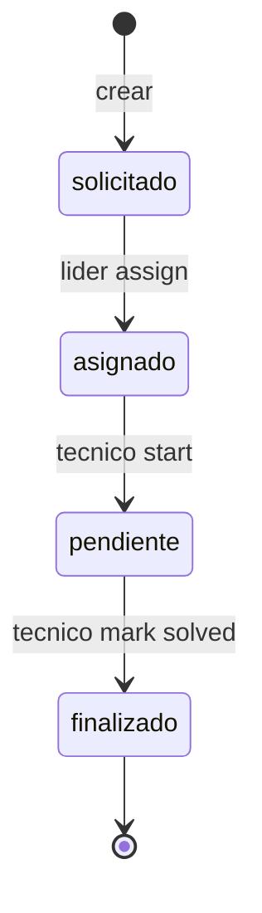
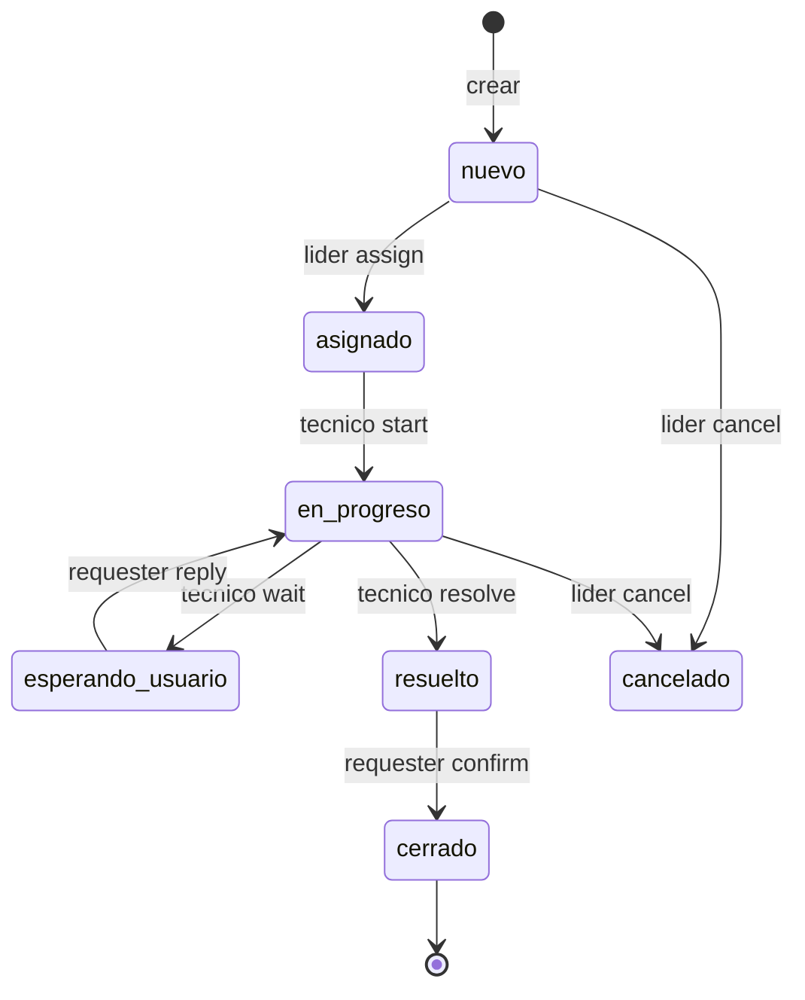

# MiAyudaTIC - Engineering History

## 6-Phase Timeline

### Phase 1: Bulk Import (Oct 30, 2024)
**Commit**: `a00655c14d11aaed1f7667247bfae71c77880f95`

- Delivered: **Complete working JavaScript application** (Express + React + JWT + 3-role RBAC + MongoDB)
- NOT a prototype → production-grade day-one MVP
- Files: `server/*`, `client/*` (JS), full auth lifecycle, caso 4 states basic, nodemailer email

### Phase 2: Quality Platform (Apr 20-Apr 24, 2026)
**Commits**: `v2.0.0-backend-ts-migration` tag

#### Batch A: Config/Utils (Apr 20)
- Migrate: `server/config/`, `server/utils/` → TypeScript
- Standardize env vars, logging, errors

#### Batch B: Middleware (Apr 21)
- Migrate: auth middleware, RBAC guards, error handlers

#### Batch C: Models (Apr 22)
- Migrate: Mongoose models + Zod validation + JSDoc

#### Batch D: Controllers (Apr 23)
- Migrate: Express routes + TS express
- Tag `v2.0.0-backend-ts-migration`

**Infrastructure**: Add Husky + commitlint + ESLint + Vitest

### Phase 3: Frontend Hardening (Jun 12-Jun 20, 2026)
- Migrate: `client/src/**/*.jsx` → TSX (feature-based)
- Email chain: nodemailer → Resend → Brevo REST API (not SMTP)
- Add Cloudinary media uploads
- Add Socket.IO server (`server/app.ts`) but **no client** connects yet
- Add CI/CD workflows (`server/.github/workflows/`)
- Production hardening: Dockerfile, Render deploy, Firebase Hosting targets

### Phase 4: Workflow v2 & Mobile (Aug 30-Sep 7, 2026)
**Core commit**: `48a67f8f` (Sep 7 2026)

#### Mobile app added (Aug 30)
- Directory: `mobile/` → Expo 56 + React Native 0.85.3 + Expo Router + TanStack Query
- Mobile rather web not PWA → separate engineering decision
- Auth flow: `SessionStatus` 6-state machine + `commitMobileSession`
- Role restrictions: líder blocked on mobile
- Flows built: funcionario create/list/detail → técnico list/detail + v2 actions
- Offline queue: `offline-store.ts` for técnico mutations
- Native forgot/reset password screens

#### Workflow v2 landed (Sep 7)
- Flow v1: `solicitado | asignado | pendiente | finalizado` (no history, no idempotency)
- Flow v2: `nuevo | en_progreso | esperando_usuario | resuelto | cerrado | cancelado`
- Append-only event log → `HistorialSolicitud` (14 event types)
- Idempotency via `operationId` + `payloadHash`
- Atomicity: transactions (Atlas) vs compensating (standalone)
- V1/V2 coexistence → `workflowVersion` field + `isLegacyWorkflow()`

### Phase 5: Design Consolidation (Sep 14-Sep 27, 2026)
- Design system tokens + components
- AI tooling (agents, skills) + documentation templates
- Batch docs: architecture, tests, contracts generated

### Phase 6: PWA & Final Hardening (Oct 8-Oct 10, 2026)
- PWA added: `sw.js` + `manifest.json` + install prompt (role aware)
- Auth hardened: dual extraction, mobile session commits
- Brand: MiAyudaTics → MiAyudaTIC
- Firebase Hosting prod+qa targets + post-deploy smoke

## Key Decisions Timeline

| Decision | Commit / Tag | Date | Rationale |
|----------|--------------|------|-----------|
| Feature-based architecture | Phase 2 | Apr 2026 | Scale codebase 6+ mo, keep related code co-located |
| Backend TS migration in 4 batches | Phase 2 | Apr 2026 | Minimize breakage, max editor static checks |
| Workflow v2 engine | `48a67f8f` | Sep 7 2026 | Replace v1 4-state linear with state machine + idempotency + audit trail |
| Expo mobile app (archived) | Phase 4 | Sep 7 2026 | Built native mobile separate workstream for técnicos without laptops |
| Dual extraction (cookie + bearer) | Phase 6 | Oct 2026 | Single API codebase services web/PWA (cookie) + native (secure store) |
| PWA mobile strategy (production) | Phase 6 | Oct 10 2026 | Official mobile delivery: single codebase with phone detection, Service Worker, and mobile install prompt |

## The Workflow v1 → v2 Evolution

### v1 (Phase 1)

- Linear 4-state
- **No history**, **no idempotency**, **no role isolation** → accidental tech allows anyone to assign
- PowerPoint-level state → no lifecycle engine → in controller logic

### v2 (Phase 4, commit `48a67f8f`)

- **State machine** isolated (`solicitud-lifecycle.ts`
- **Audit log** via `HistorialSolicitud` append-only
- **Idempotency** (`operationId` + `payloadHash`)
- **Role isolation** (validationPrecondition for each action)
- **V1/V2 coexistence** via `workflowVersion` + `isLegacyWorkflow()` guard

### v2 Files & Responsibilities

| File | Responsibility |
|------|---------------|
| `solicitud-lifecycle.ts` | Pure state machine (valid transitions, preconditions) |
| `solicitud-workflow.ts` | Orchestrator: calls lifecycle, appends historial, sends email |
| `workflow-idempotency.ts` | Dedup via `operationId` + `payloadHash` (403 Conflict on dup) |
| `workflow-atomicity.ts` | Chooses transactions (Atlas) vs compensating logic (standalone) |
| `workflow-runtime.ts` | Boot: asserts unique index existence |`HistorialSolicitud` model | Append-only event log (14 event types): `asignada`, `en_progreso`, `resuelta`, `cerrada`, `reabierta`, `cancelada`, `espera_usuario`, `respuesta_usuario` |

## Mobile Evolution (Three Strategies)

### 1. PWA Mobile Strategy (`client/` PWA features) — **PRODUCTION**
- Added: Phase 6 (2026-10-10)
- Tech: Service Worker v7 + Manifest + Role-aware install nudge + Triple mobile detection
- Implementation: Single codebase extends web to mobile via `usePhoneLayout` detection and 7 dedicated phone UI components
- **Official production** mobile delivery strategy
- Mobile detection: UserAgent + viewport < 768px + touch capability
- Phone UI: Dedicated components in `client/src/features/auth/phone/` (Welcome, Login, Register, Forgot, ResetPassword)
- Offline support: Service Worker network-first HTML, cache-first assets, offline.html fallback
- Auto-update: Version checking every 5 minutes with auto-reload on new deploy

### 2. Native Expo App (`mobile/`) — **ARCHIVED**
- Added: Phase 4 (2026-09-07)
- Tech: Expo 56 + React Native 0.85.3 + Expo Router + TanStack Query
- Built flows: funcionario auth, solicitud create/list, técnico cases list/detail, offline queue with JSONL file persistence
- Status: Nearly complete (~80-100% built) but replaced by PWA strategy in Phase 6
- Decision: Single codebase via PWA preferred over separate native development
- Exists in repo but not deployed to production

### 3. Flutter Legacy (`mobile_flutter/`)
- Status: **untracked** by git, wrong backend URL, not developed
- **Aborted** strategy
- Note: Strategies evolved but are not all active; PWA alone serves as production mobile delivery

## Architecture Changes Per Phase

| Phase | Date | Scope | Decision |
|-------|------|-------|-----------|
| 1 | 2024-10-30 | `server/*`, `client/*` | Deliver complete app day one |
| 2 | 2026-04-20 | `server/**/*.js` → `ts` | Backend TS migration batched |
| 3 | 2026-06-12 | `client/**/*.jsx` → `tsx` | Frontend TS migration |
| 3 | 2026-06-20 | `server/app.ts` | Socket.IO added (unconnected) |
| 4 | 2026-08-30 | `server/src/features/solicitud-*` | Workflow v2 engine |
| 4 | 2026-09-07 | `mobile/` | Expo app + offline queue |
| 5 | 2026-09-14 | `docs/`, `.agents/` | Docs templates + AI integration |
| 6 | 2026-10-08 | `client/public/sw.js` | PWA features |
| 6 | 2026-10-10 | `client/public/manifest.json` | Web manifest |
