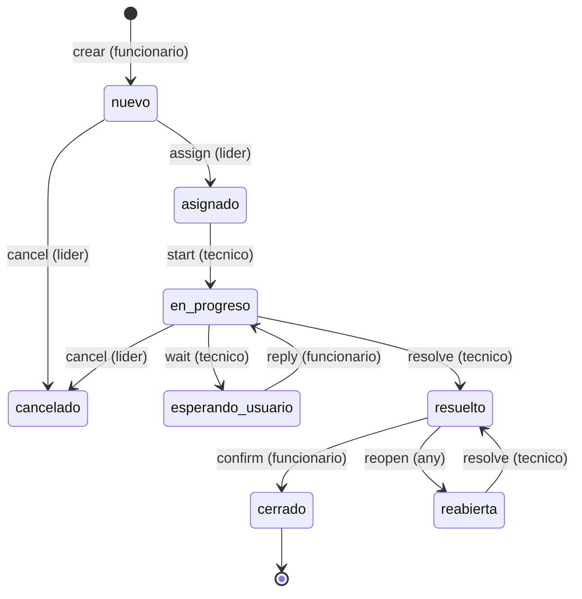
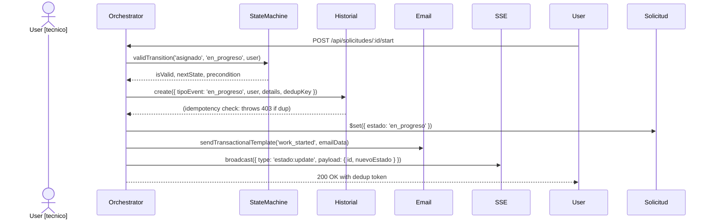

# MiAyudaTIC Workflow v2 Engine

## State Machine



## All States and Transitions

### States

| State | Description | Role Who Can Trigger | Role Isolation |
|-------|-------------|----------------------|-----------------|
| nuevo | Created by funcionario, not yet picked | lider assign, lider cancel | Only lider |
| asignado | Assigned to tecnico, not yet started | tecnico start, lider reassign | Only assignee |
| en_progreso | TECNICO is actively working | tecnico wait, tecnico resolve, lider cancel | Only assignee |
| esperando_usuario | TECNICO waiting for funcionario reply | funcionario reply, tecnico resolve, lider cancel | Only requester |
| resuelto | TECNICO marked as solved | funcionario confirm, funcionario reopen | Both |
| cerrado | Funcionario confirmed resolution | (final) | None |
| cancelado | Lider cancelled before closed | (final) | None |

### Role Validation Preconditions

| Action | Allowed Roles | Precondition Check |
|--------|--------------|---------------------|
| create | funcionario | tipoRol === 'funcionario' |
| assign | lider | tipoRol === 'lider' && current === 'nuevo' |
| reassign | lider | tipoRol === 'lider' && current === 'asignado' |
| start | tecnico | tipoRol === 'tecnico' &&  asignado === true |
| wait | tecnico | tipoRol === 'tecnico' && asignado === true |
| reply | funcionario | tipoRol === 'funcionario' && estado === 'esperando_usuario' |
| resolve | tecnico | tipoRol === 'tecnico' && (asignado + not cerrado) |
| confirm | funcionario | tipoRol === 'funcionario' && estado === 'resuelto' |
| reopen | all | estado === 'resuelto' |
| cancel | lider | tipoRol === 'lider' && (nuevo | en_progreso) |

### Guard Clauses

```ts
// Guard example: only lider can assign
if (user.tipoRol !== 'lider') throw new Error('403 Double Role Conflict');

// Guard: only assignee can start
if (solicitud.tecnico !== user._id) throw new Error('403 Technician Role Conflict');

// Guard: only requester can confirm
if (solicitud.solicitante !== user._id) throw new Error('403 Requester Role Conflict');

// Guard: only lider can cancel
if (user.tipoRol !== 'lider') throw new Error('403 Cancel Role Conflict');
```

## Idempotency Protocol

- contextKey: operationId + payloadHash -> unique dedup key
- payloadHash: SHA256($'{action}:{userId}:{solicitudId}:{details}')
- Generates: MongoDB unique index on HistorialSolicitud.operationId
- Behavior: 403 Conflict on duplicate operationId
- File: workflow-idempotency.ts

```ts
// Example: Tecnico tries same action twice -> first succeeds, second 403 Conflict
const ctxKey = '${action}:${user.id}'; // Example: 'resolve:user123'

try {
  await HistorialSolicitud.create({ operationId: ctxKey, ... });
} catch (e) {
  if (e.code === 11000) { // Dup key
    return boom.conflict('Idempotency conflict');
  }
}
```

## Atomicity Strategy

- Atlas (prod): Real transactions (startSession, commitTransaction, abortTransaction)
- Standalone (local): Compensating logic (beginTransaction: { atomic: false })
- Runtime choice: At boot server/app.ts checks MongoDB connection options
- File: workflow-atomicity.ts

## V1/V2 Coexistence

| Aspect | Flow v1 | Flow v2 | Coexistence |
|-------|--------|--------|--------------|
| States | solicitado | asignado |  pendiente | finalizado | nuevo | en_progreso |  esperando | resuelto | cerrado | cancelado | workflowVersion field |
| Engine | Inline controller logic | Isolated solicitud-lifecycle.ts | isLegacyWorkflow(s) guard |
| History | No audit log | HistorialSolicitud (14 event types) | Past casos use v1 |
| Atomicity | No transactions | Strict transactions | Client versions detected |
| Idempotency | No dedup | operationId + payloadHash | Graceful Conflict 403 |

```ts
// Guard: route to v1 or v2 state engine
isLegacyWorkflow(solicitud): boolean { return !solicitud.workflowVersion; }
```

## How Historial Works



- 14 event types logged to HistorialSolicitud:
  - creada, asignada, reabierta, iniciada, en_progreso, resuelta, cerrada, cancelada, esperando_usuario, respuesta_usuario, notada, cambiada, _legacy_marked_v2, _legacy_migrated_manual, TECH_bug filed (internal)

## Key File Contracts

### solicitud-lifecycle.ts
- Pure state machine
- No I/O, no DB, no async
- Input: currentState | user | solicitud
- Output: valid boolean + nextState + allowedRoles + precondition guard
- Used by orchestrator + used by client to show UI buttons

### solicitud-workflow.ts
- Orchestrator I/O + side effects
- Steps: validate - prep transaction - dedup check - mutate state - append historial - broadcast SSE - send email
- Returns dedup token for retry header: X-Dedup-Token

### workflow-idempotency.ts
- Deduplication logic (unique index) + payloadHash calculation
- Runtime check: HistorialSolicitud.exists({ operationId }) -> 403 Conflict if exists

### workflow-atomicity.ts
- Transactions strategy runtime decision
- Transforms: Atlas -> real transactions, local -> compensating

### workflow-runtime.ts
- Boot assertion that operationId unique index exists in HistorialSolicitud

### mobile/libs/workflow mobile-version.ts
- Mobile client mirror of lifecycle reusable (native type-safe apis)

## Safety Props

1. Role column only leader can cancel -> ROL column isolation
2. Idempotency conflict 403 -> client can safely retry duplicate
3. V1/V2 coexistence guard -> never break legacy workflow running
4. Historial append-only -> never delete events
5. Operation retries via token -> X-Dedup-Token allows replay
6. Pessimistic transactions -> Atlas only
7. Standalone compensating logic -> local local does not block

## CV-Ready Bullet (English)

\"Implemented Workflow v2 state machine engine: atomic transactions, idempotency keys, 6-state RBAC isolation, append-only audit log, V1/V2 coexistence guard, 14 event types.\"

## CV-Ready Bullet (Spanish)

\"Implementé el motor de workflow v2: máquina de estados atómica con llaves de idempotencia, aislamiento RBAC 6 roles, registro de auditoría append-only, guardia de coexistencia v1/v2, y 14 tipos de eventos.\"