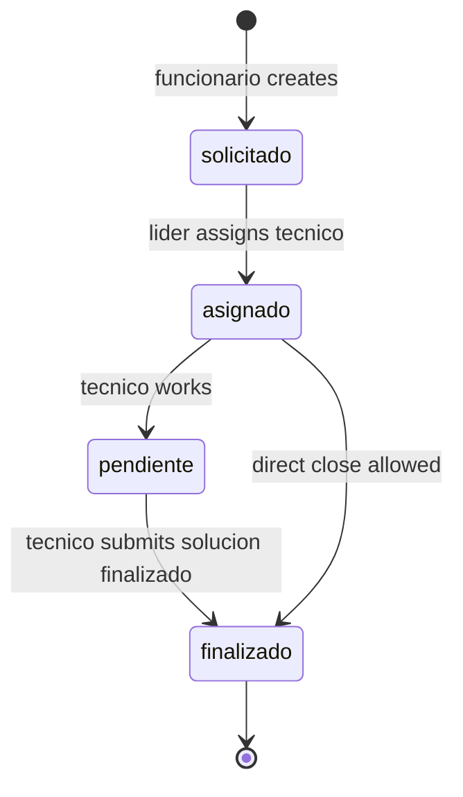

# contracts.md — MiAyudaTIC

> **Single source of truth** for business invariants, permissions, and shared types.  
> Code package: `packages/contracts` (`@miayuda/contracts`). Clients **must converge** here.

---

## Naming conventions

| Layer | Convention | Example |
|-------|------------|---------|
| API paths | camelCase Spanish legacy | `/api/solicitud`, `/solucionCaso` |
| Mongo models | PascalCase | `Solicitud`, `Usuario` |
| Roles | lowercase Spanish | `funcionario`, `tecnico`, `lider` |
| Socket events | camelCase in `RealtimeEvents` | `actualizarSolicitud` |
| Media folders | enum `MediaFolder` | `evidencias`, `perfiles`, `storage` |
| Env vars | SCREAMING_SNAKE | `VITE_BACKEND_URL`, `EXPO_PUBLIC_API_URL` |

---

## Entities (conceptual)

### Usuario

| Field | Invariant |
|-------|-----------|
| `rol` | `funcionario` \| `tecnico` \| `lider` |
| `activo` | false → blocked |
| `estado` | técnico requires `true` after líder approval |
| `correo` | unique |
| Register | only `funcionario` \| `tecnico` — never `lider` |

### Solicitud (ticket)

| Field | Invariant |
|-------|-----------|
| `codigoCaso` | unique per consecutivo rules |
| `estado` | see state machine below |
| `workflowVersion` | absent = legacy v1; `2` = workflow nuevo |
| `usuario` | creator (funcionario) |
| `tecnico` | set only by líder assign |
| `solucion` | set when técnico closes |

### SolucionCaso

| Field | Invariant |
|-------|-----------|
| `solicitud` | 1:1 active solution per solicitud |
| `tipoSolucion` | `pendiente` \| `finalizado` |
| `evidencia` | optional Storage ref |
| Scope | **legacy v1 only** — never use for `workflowVersion: 2` |

### Ambiente, TipoDeCaso, Storage, Notificacion

- **Ambiente:** `activo` flag; líder CRUD.
- **TipoDeCaso:** catalog; líder write; all roles read.
- **Storage:** `{ url, filename }` after upload.
- **Notificacion:** `tipo: estado_ticket`; scoped to `usuario`.

---

## Ticket state machine

`workflowVersion` absent (or not `2`) = **legacy v1**. `workflowVersion: 2` = **workflow nuevo**. There is no mass migration: old tickets keep v1 strings and `SolucionCaso`.

### Legacy v1 (`workflowVersion` absent)

```
solicitado → asignado → pendiente → finalizado
```

| Estado | Quién lo pone | Notas |
|--------|---------------|--------|
| `solicitado` | funcionario al crear (tickets viejos) | cola líder v1 |
| `asignado` | líder `PUT /:id/asignarTecnico` | técnico asignado |
| `pendiente` | técnico `POST /solucionCaso` `tipoSolucion=pendiente` | opcional |
| `finalizado` | técnico `POST /solucionCaso` `tipoSolucion=finalizado` | cierre v1 |

**SolucionCaso** is the only close path for v1. Do not call workflow v2 actions on these tickets (409).

### Workflow v2 (`workflowVersion: 2`)

New tickets persist `estado: 'nuevo'` and `workflowVersion: 2`. Schema default remains `'solicitado'` only as a safety net for accidental creates.

| Estado | Significado |
|--------|-------------|
| `nuevo` | Enviada; espera asignación |
| `asignado` | Técnico responsable; aún no inicia |
| `en_progreso` | En atención (incluye solución parcial) |
| `esperando_usuario` | Falta información del funcionario |
| `resuelto` | Solución total; espera confirmación |
| `cerrado` | Funcionario confirmó |
| `cancelado` | Líder canceló (ticket se conserva) |

| Acción | Desde | Hacia | Rol |
|--------|-------|-------|-----|
| `assign` | `nuevo` | `asignado` | líder |
| `reassign` | `asignado` | `asignado` | líder |
| `reassign` | `en_progreso` | `asignado` | líder |
| `reassign` | `esperando_usuario` | `esperando_usuario` | líder |
| `start` | `asignado` | `en_progreso` | técnico asignado |
| `update` | `en_progreso` | `en_progreso` | técnico asignado |
| `wait_for_requester` | `en_progreso` | `esperando_usuario` | técnico asignado |
| `requester_reply` | `esperando_usuario` | `en_progreso` | funcionario dueño |
| `partial_solution` | `en_progreso` | `en_progreso` | técnico asignado |
| `resolve` | `en_progreso` | `resuelto` | técnico asignado |
| `confirm` | `resuelto` | `cerrado` | funcionario dueño |
| `reopen` | `resuelto` | `en_progreso` | funcionario dueño |
| `cancel` | `nuevo` \| `asignado` | `cancelado` | líder |

Reassign is forbidden in `nuevo`, `resuelto`, `cerrado`, `cancelado`. Motivo is required.

### List vs detail

| Superficie | Historial |
|------------|-----------|
| Listados / cards (`toSolicitudListItem`) | **nunca** serializa `historial`, `events`, `historialNextCursor` |
| Detalle `GET /api/solicitud/:id` | puede incluir `historial` + `historialNextCursor` |
| `GET /api/solicitud/:id/historial` | página de eventos v2 |

Cursor de historial (detalle y endpoint dedicado):

| Query / campo | Uso |
|---------------|-----|
| `historialLimit` | 1–100; default 50 |
| `historialBefore` | ObjectId cursor (eventos posteriores a ese `_id`) |
| `historialNextCursor` | siguiente página; ausente = no hay más |

Tickets v1 no tienen `HistorialSolicitud`; el detalle puede incluir `historyNote`.

### Idempotency-Key

Convención primaria: header HTTP `Idempotency-Key`. El servidor **no** genera UUID si falta.

`body.operationId` es el mismo valor solo si el header no viene (p. ej. clientes que ya lo mandaban en JSON). Si ambos faltan:

```http
400 Bad Request
{ "code": "IDEMPOTENCY_KEY_REQUIRED", "message": "La acción requiere Idempotency-Key." }
```

Obligatorio en:

`reasignarTecnico`, `iniciarAtencion`, `actualizacion`, `solicitarInformacion`, `solucionParcial`, `solucionTotal`, `responder`, `confirmarSolucion`, `reabrir`, `cancelar` (y `asignarTecnico` v2, misma regla).

Web y mobile generan una UUID **una vez por intención** (`acción + solicitudId + payload`). La conservan para un **retry manual** del mismo intento (misma key + mismo payload). **Retry automático de mutaciones workflow v2 = 0.** No hay retry automático para 5xx, red, timeout ni 429, ni polling. Nueva key solo si el usuario inicia una intención nueva o cambia el contenido (mensaje, motivo, qué se hizo, adjunto, etc.). Se descarta al éxito, 4xx terminal, cancelación o acción distinta.

| Caso | Resultado |
|------|-----------|
| Sin key | 400 `IDEMPOTENCY_KEY_REQUIRED`. Sin mutar. Sin UUID de servidor |
| Misma key + mismo actor + misma acción + mismo payload | 200 con el resultado original; no duplica evento; no reaplica transición |
| Misma key + payload distinto | 409 `La clave de idempotencia no puede reutilizarse.` Sin mutar. Sin datos sensibles |
| Misma key + acción distinta | 409; no reutiliza el resultado |
| Misma key + actor distinto | 409; no filtra ni devuelve el resultado del otro actor |

**Índice único:** `{ solicitud: 1, operationId: 1 }` sparse (`uniq_historial_solicitud_operationId`). Lo crea **solo** `pnpm --dir server migrate:historial-operation-id`, no autoIndex. First writer wins per ticket key. Actor, `actionType` y `payloadHash` se comparan en código. `payloadHash` cubre campos de negocio — nunca password, JWT ni `Authorization`.

Producción: exige transacciones Mongo y este índice al arrancar / antes de mutar v2. Si faltan, 503 o el proceso no escucha. No hay fallback standalone silencioso.

### Adjuntos

`GET /api/storage/:id` y `GET /api/media/local/:filename` autorizan por **acceso actual al ticket vinculado**, no por autor del archivo.

| Actor | Dueño | Técnico asignado | Líder | Técnico ajeno | Funcionario ajeno | Anónimo |
|-------|:-----:|:----------------:|:-----:|:-------------:|:-----------------:|:-------:|
| Ver foto/evidencia | Sí | Sí | Sí | No | No | No |

ObjectId o filename válidos no conceden acceso solos. Path traversal → 400. Sin URL externa arbitraria.

---

## Ticket state machine (legacy diagram)



**Verified enum in code:** includes both v1 (`solicitado | asignado | pendiente | finalizado`) and v2 (`nuevo | en_progreso | esperando_usuario | resuelto | cerrado | cancelado`) (`server/src/features/tickets/models/solicitud.ts`). `asignado` exists in both.

**Business rules:**
- Only `funcionario` creates solicitud.
- Only `lider` assigns `tecnico`.
- Only `tecnico` posts `solucionCaso` (**v1 only**).
- Delete solicitud: `lider` only (deprecated; v2 uses `POST /:id/cancelar`).

---

## Permission matrix (API)

| Action | funcionario | tecnico | lider |
|--------|:-----------:|:-------:|:-----:|
| POST /solicitud | ✓ | — | — |
| GET own historial | ✓ | — | — |
| GET /solicitud/pendientes | — | — | ✓ |
| GET /solicitud/asignadas | — | ✓ | — |
| POST /solucionCaso/:id | — | ✓ | — |
| PUT asignarTecnico | — | — | ✓ |
| /tecnicos/* approve | — | — | ✓ |
| /tipoCaso POST/PUT/DELETE | — | — | ✓ |
| /ambienteFormacion write | — | — | ✓ |
| GET /usuarios/perfil | ✓ | ✓ | ✓ |
| POST /media/upload | ✓ | ✓ | ✓ |
| Mobile app login | ✓ | ✓ | **blocked** |

---

## Auth contract

| Transport | Header / storage | TTL |
|-----------|------------------|-----|
| Web | httpOnly cookie `token` | 7200s |
| Mobile | `Authorization: Bearer` + SecureStore | 7200s |
| Socket | `auth.token` or Bearer | connection-bound |

**Verify:** `GET /api/auth/verify-token`  
**Logout:** `POST /api/auth/logout` + clear client storage

---

## Payload contracts (Zod — `packages/contracts`)

### Solicitud create fields

```typescript
// packages/contracts/src/solicitud.ts
ambiente: ObjectId string
tipoCaso: ObjectId string
descripcion: min 10 chars
telefono: min 1
usuario: ObjectId string
fotoId?: ObjectId string
```

### Solución fields

```typescript
descripcionSolucion: min 5
tipoCaso: ObjectId string
tipoSolucion: 'pendiente' | 'finalizado'
```

### Media upload response

See `packages/contracts/src/media.ts` — `MediaUploadResponse`, `MediaFolder`.

---

## Socket events (`packages/contracts/src/socket.ts`)

| Event | Payload summary |
|-------|-----------------|
| `connection:ack` | userId, serverTime |
| `actualizarSolicitud` | solicitudId, estado, … |
| `actualizarTecnico` | tecnicoId, numeroSolicitudesAsignadas |
| `nuevaNotificacion` | full notification document |

**Client obligation:** subscribe after auth; handle reconnect with backoff.

---

## Expected errors (API)

| Code | Meaning | Client behavior |
|------|---------|-----------------|
| 400 | Idempotency-Key ausente (`IDEMPOTENCY_KEY_REQUIRED`) | No reintentar con una key nueva del servidor; el cliente debe reenviar la del intento |
| 401 | No/invalid token | Redirect login |
| 403 | Wrong role or pending técnico | Role-specific message |
| 409 | Transición, idempotencia o ticket legacy | Mostrar mensaje; no reintentar con la misma key si el payload cambió |
| 422 | Zod validation | Inline field errors |
| 429 | Rate limit | Sin retry automático. Si hay `Retry-After`, mostrar espera y deshabilitar el CTA `Reintentar acción` hasta que venza. Si no hay header, mostrar el copy de rate limit y no adivinar delay |
| 500 | Server error | Toast + CTA manual `Reintentar acción` (misma key y payload). Sin retry automático |
| 503 | Transacciones Mongo no disponibles (Atlas path) | No tratar como éxito; CTA manual más tarde. Sin retry automático |

**Security:** `recuperarPassword` — same response whether email exists or not.

---

## Checklist E2E remoto de workflow v2

Un E2E contra el Render **actual** no valida esta implementación: ese API todavía corre el backend anterior. Sin deployment, Render no puede probar workflow v2.

La falta de `e2e/.env.e2e` o de cuentas **no** es el único bloqueo, ni siquiera el principal.

Condición real para E2E remoto:

1. Código workflow v2 desplegado en un entorno remoto aprobado (preview/QA aislado, staging aislado u otra estrategia).
2. Índice `uniq_historial_solicitud_operationId` verificado en la base de **ese** entorno.
3. Transacciones Mongo soportadas y verificadas (no fallback standalone).
4. Storage aislado/configurado para evidencias de esa prueba.
5. Cuentas E2E no personales con los tres roles.
6. Credenciales protegidas fuera de git. No crear `.env.e2e` con secretos reales en este workstream.
7. Estrategia de limpieza trazable, sin `DELETE` destructivo de tickets (usar cancelación v2).

Hasta que se decida formalmente el entorno remoto, no preparar ni crear cuentas E2E.

Checklist de producto (solo después de los 7 puntos):

- [ ] `workflowVersion` ausente = v1; `2` = flujo nuevo; tickets nuevos nacen `nuevo` + v2
- [ ] Listados sin `historial`; detalle y `GET /:id/historial` con cursor
- [ ] Mutaciones v2 con `Idempotency-Key` del cliente; 400 si falta; replay idéntico; 409 si se reutiliza la key
- [ ] Reasignación líder en `asignado` / `en_progreso` / `esperando_usuario` con motivo
- [ ] `resuelto` aparece en Esperando confirmación, no en En atención
- [ ] `POST /solucionCaso` no se usa en tickets v2
- [ ] Foto/evidencia: dueño, técnico asignado y líder sí; ajenos y anónimos no
- [ ] Atlas: update de Solicitud + insert de HistorialSolicitud en la misma transacción

---

## Adoption status (honest)

| Consumer | Uses `@miayuda/contracts` |
|----------|---------------------------|
| server | **Yes** |
| client | **No** — local `domain.ts` (debt) |
| mobile Expo | **No** — local Zod (debt) |

**Rule for new work:** extend `packages/contracts` first, then import in server; client/mobile follow in same PR or immediate follow-up.

---

## Invariants (never violate)

1. Server validates every write — client checks are UX only.
2. Técnico cannot login until líder approves.
3. Líder cannot self-register via public API.
4. Ticket state transitions only through defined controllers.
5. Media URLs must come from Storage model or Cloudinary — no arbitrary external URLs in DB.
6. JWT payload contains only `{ _id, rol }` — no PII in token.

---

## References

- Package source: `packages/contracts/src/`
- Route evidence: `archive/audits/2026-06-13-code-audit/backend-audit.md`
- Architecture: `docs/architecture.md`
