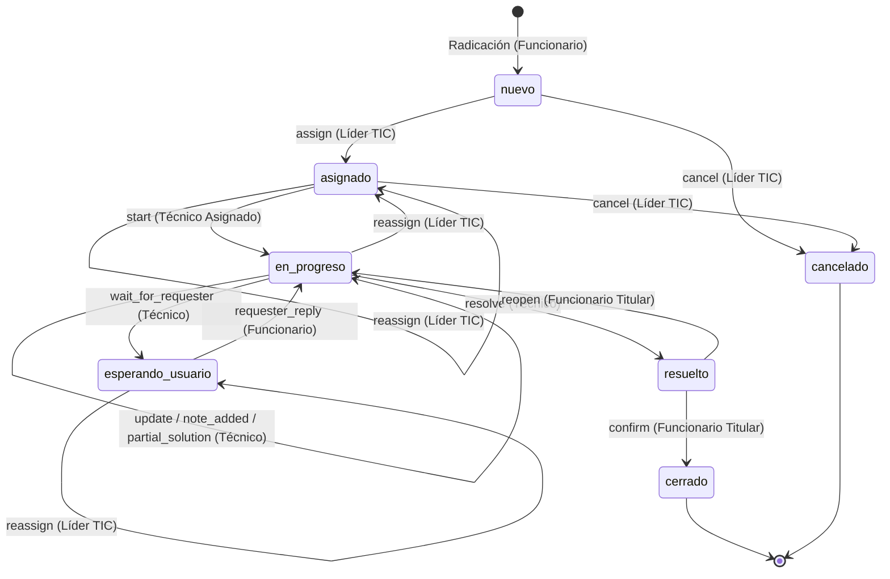

# 04 — Modelo de Dominio y Ciclo de Vida (Domain Model & Lifecycle)

> **Clasificación:** `VERIFIED` en `server/src/features/tickets/domain/solicitud-lifecycle.ts`, `solicitud-workflow.ts` y `@miayuda/contracts`.

---

## 1. Entidades Principales del Dominio

```text
┌───────────────────────┐         1:N         ┌─────────────────────────┐
│        Usuario        │────────────────────<│        Solicitud        │
│  - nombre             │                     │  - codigoCaso           │
│  - correo             │                     │  - estado (v1/v2)       │
│  - rol (enum)         │                     │  - workflowVersion      │
│  - activo, estado     │                     │  - workflowRevision     │
└───────────────────────┘                     └────────────┬────────────┘
            ▲                                              │
            │                                              │ 1:N
            │ Asignado como Técnico                        ▼
            └─────────────────────────────────┌─────────────────────────┐
                                              │   HistorialSolicitud    │
                                              │  - type (enum)          │
                                              │  - message              │
                                              │  - author (Usuario ref) │
                                              │  - operationId (UUID)   │
                                              │  - metadata, attachment │
                                              └─────────────────────────┘
```

---

## 2. Máquina de Estados Canónica (Workflow v2)

Para solicitudes con `workflowVersion === 2`, el ciclo de vida se rige estrictamente por la siguiente máquina de estados finitos:



---

## 3. Matriz Estricta de Transiciones de Estado

| Acción (`SolicitudWorkflowAction`) | Estado Origen | Estado Destino | Actor Autorizado | Efecto Secundario / Evento en Historial |
|---|---|---|---|---|
| `assign` | `nuevo` | `asignado` | `lider` | Vincula `tecnico`. Evento `assigned`. Notifica a técnico y solicitante. |
| `reassign` | `asignado`, `en_progreso` | `asignado` | `lider` | Requiere motivo. Evento `reassigned`. Notifica a técnico previo, nuevo técnico y solicitante. |
| `reassign` | `esperando_usuario` | `esperando_usuario` | `lider` | Requiere motivo. Mantiene estado de espera para no alterar al funcionario. |
| `start` | `asignado` | `en_progreso` | `tecnico` (asignado) | Evento `started`. Notifica al funcionario de inicio de labores. |
| `update` | `en_progreso` | `en_progreso` | `tecnico` (asignado) | Evento `note_added`. Evidencia opcional adjunta. |
| `wait_for_requester` | `en_progreso` | `esperando_usuario` | `tecnico` (asignado) | Evento `waiting_for_requester`. Notificación prioritaria al solicitante. |
| `requester_reply` | `esperando_usuario` | `en_progreso` | `funcionario` (dueño) | Evento `requester_reply`. Desbloquea la atención del técnico. |
| `partial_solution` | `en_progreso` | `en_progreso` | `tecnico` (asignado) | Evento `partial_solution`. Guarda qué se hizo, qué falta y fecha compromiso. |
| `resolve` | `en_progreso` | `resuelto` | `tecnico` (asignado) | Evento `resolved`. Establece `resolvedAt`. Queda a la espera de confirmación. |
| `confirm` | `resuelto` | `cerrado` | `funcionario` (dueño) | Evento `closed`. Establece `closedAt`. Estado terminal definitivo. |
| `reopen` | `resuelto` | `en_progreso` | `funcionario` (dueño) | Requiere motivo de rechazo. Evento `reopened`. Notifica al técnico para retornar. |
| `cancel` | `nuevo`, `asignado` | `cancelado` | `lider` | Requiere motivo. Establece `cancelledAt`. Estado terminal. No se puede cancelar en atención. |

---

## 4. Resolución de Roles de Caso (`CaseRole`)

El sistema implementa una resolución estricta por IDs para evitar confusiones de rol en la bitácora:
- `SOLICITANTE`: Si el autor coincide con `solicitud.usuario` o el evento es `created`/`requester_reply`.
- `TECNICO_ASIGNADO`: Si el autor coincide con `solicitud.tecnico` o tiene rol técnico.
- `MESA_TIC`: Si el autor es `lider` o el evento es asignación/reasignación/cancelación.
- `UNKNOWN`: Si no puede determinarse inequívocamente (**nunca fallback silencioso a MESA_TIC**).

---

## 5. Garantía de Idempotencia y Concurrencia

1. **Header `Idempotency-Key` Requerido:** Toda mutación de Workflow v2 exige el header HTTP `Idempotency-Key` (o falla con `400 IDEMPOTENCY_KEY_REQUIRED`).
2. **Índice Unique en Base de Datos:** `uniq_historial_solicitud_operationId` sobre `{ solicitud, operationId }` impide duplicación física a nivel motor.
3. **Control Optimista de Revisiones:** Cada actualización incrementa `workflowRevision` en `Solicitud`. Si una mutación concurrente choca, el motor rechaza la segunda o retorna el resultado cacheado del `operationId`.
4. **Cero Retries Automáticos en Mutaciones:** En caso de error de red, la interfaz no reintenta silenciosamente; el usuario tiene un botón explícito de reintento que reenvía exactamente el mismo `Idempotency-Key` y hash de payload.
