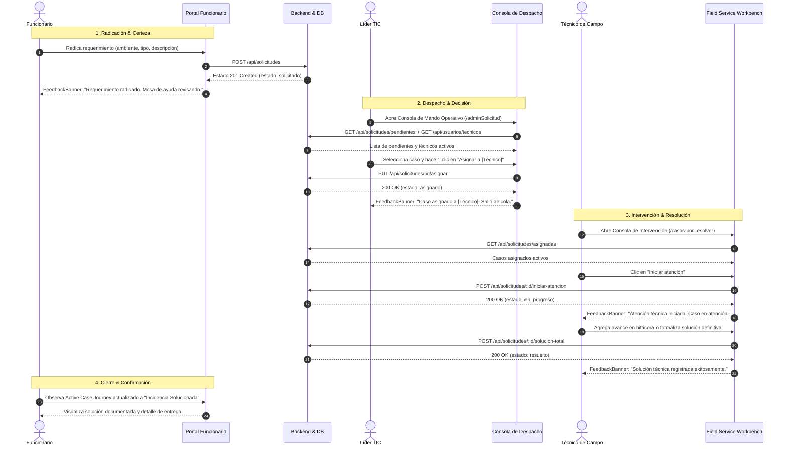

# Service Blueprint — MiAyudaTICS

```mermaid
sequenceDiagram
    autonumber
    actor F as Funcionario
    participant UI_F as Portal Funcionario
    participant BE as Backend & DB
    actor L as Líder TIC
    participant UI_L as Consola de Despacho
    actor T as Técnico de Campo
    participant UI_T as Field Service Workbench

    Note over F,UI_F: 1. Radicación & Certeza
    F->>UI_F: Radica requerimiento (ambiente, tipo, descripción)
    UI_F->>BE: POST /api/solicitudes
    BE-->>UI_F: Estado 201 Created (estado: solicitado)
    UI_F-->>F: FeedbackBanner: "Requerimiento radicado. Mesa de ayuda revisando."

    Note over L,UI_L: 2. Despacho & Decisión
    L->>UI_L: Abre Consola de Mando Operativo (/adminSolicitud)
    UI_L->>BE: GET /api/solicitudes/pendientes + GET /api/usuarios/tecnicos
    BE-->>UI_L: Lista de pendientes y técnicos activos
    L->>UI_L: Selecciona caso y hace 1 clic en "Asignar a [Técnico]"
    UI_L->>BE: PUT /api/solicitudes/:id/asignar
    BE-->>UI_L: 200 OK (estado: asignado)
    UI_L-->>L: FeedbackBanner: "Caso asignado a [Técnico]. Salió de cola."

    Note over T,UI_T: 3. Intervención & Resolución
    T->>UI_T: Abre Consola de Intervención (/casos-por-resolver)
    UI_T->>BE: GET /api/solicitudes/asignadas
    BE-->>UI_T: Casos asignados activos
    T->>UI_T: Clic en "Iniciar atención"
    UI_T->>BE: POST /api/solicitudes/:id/iniciar-atencion
    BE-->>UI_T: 200 OK (estado: en_progreso)
    UI_T-->>T: FeedbackBanner: "Atención técnica iniciada. Caso en atención."
    
    T->>UI_T: Agrega avance en bitácora o formaliza solución definitiva
    UI_T->>BE: POST /api/solicitudes/:id/solucion-total
    BE-->>UI_T: 200 OK (estado: resuelto)
    UI_T-->>T: FeedbackBanner: "Solución técnica registrada exitosamente."

    Note over F,UI_F: 4. Cierre & Confirmación
    F->>UI_F: Observa Active Case Journey actualizado a "Incidencia Solucionada"
    UI_F-->>F: Visualiza solución documentada y detalle de entrega.
```
