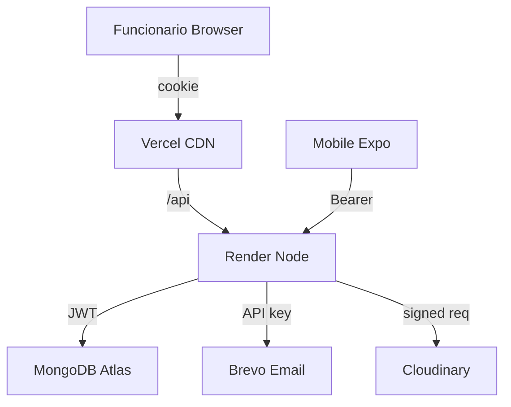

# Security Posture — MiAyudaTIC

> Current security controls and compliance status

---

## Core controls

### Authentication
- **Web:** httpOnly cookie `token` (7200s TTL)
- **Mobile:** Bearer JWT in SecureStore (7200s TTL)
- **Socket.IO:** Authenticated via cookie, Bearer, or `auth.token`

### Authorization
- **RBAC:** `checkRol([...roles])` on every protected route
- **Validator:** `accountStatus.ts` enforces técnico approval by líder
- **No self-service líder:** Líder cannot self-register via public API

### Transport security
- **CORS:** Explicit whitelist in production; dev localhost regex
- **Helmet:** Security headers
- **Rate limiting:** 20 req / 15 min for auth, password, upload endpoints
- **HTTPS:** Enforced via Firebase Hosting and Render

### Data protection
- **Password reset:** No email enumeration; same response whether email exists
- **Reset tokens:** Hashed in database
- **JWT payload:** Only `{ _id, rol }` — no PII in token
- **Media validation:** Magic-byte MIME check; size cap `MEDIA_MAX_BYTES`
- **Upload isolation:** `#{{random.value}}#` folders prevent path traversal

---

## Affected surfaces

| Surface | Security mechanisms |
|---------|-------------------|
| Web | Cookie auth, CSRF protection via SameSite, CSP via meta tag |
| API | JWT validation, RBAC middleware, input validation via Zod |
| Mobile | SecureStore, no WebView, native auth flows |

---

## Threat model

### Trust boundaries

Invested actors:
- Internal SENA: Líder TIC, Funcionario, Técnico (institutional accounts)
- No public self-register; all accounts created by Líder TIC

### Entry points
- `POST /api/auth/login` — rate limited
- `POST /api/auth/recuperarPassword` — no enumeration
- Ticket uploads — MIME magic byte validated
- Socket.IO handshake — authenticated

### Gaps
- **Sentry:** Not deployed — target Stage 2
- **Redis:** Socket.IO multi-instance not configured (no HA)
- **Offline mobile:** No device-level encryption for drafts (target v3)

---

## Incident response

### Reporting
Vulnerabilities: Report to Líder TIC via email with:
- Description
- Reproduction steps
- Estimated impact
- Do **not** publish in public issues

### Rotation procedures

| Secret | Rotation impact |
|--------|-----------------|
| `JWT_SECRET` | Render env → redeploy → invalidates active sessions |
| `DB_URI` | MongoDB Atlas → Database Access |
| `BREVO_API_KEY` | Brevo dashboard |

---

## Compliance status

| Area | Status |
|------|--------|
| Production URLs | Web: `miayudatics.web.app` · API: `miayudatics-v1-0.onrender.com` |
| Backups | MongoDB Atlas continuous backups enabled |
| Evidence storage | Cloudinary (production) or local `STORAGE_PATH` (dev only) |

---

## References

- Architecture: `architecture/ARCHITECTURE.md` § Security architecture
- Dependent triage: `security/SUPPLY_CHAIN.md`
- Contracts: `architecture/DATA_MODEL.md` — invariants and auth contract
