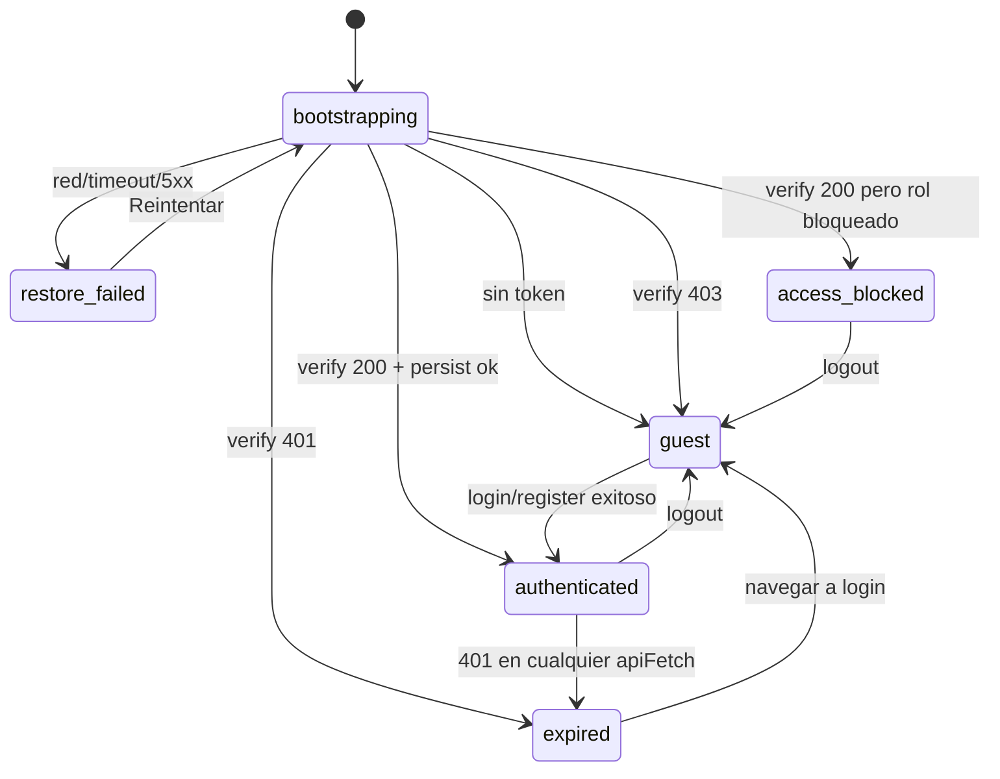
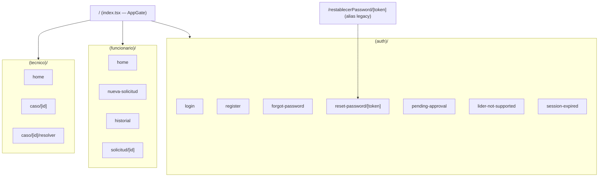
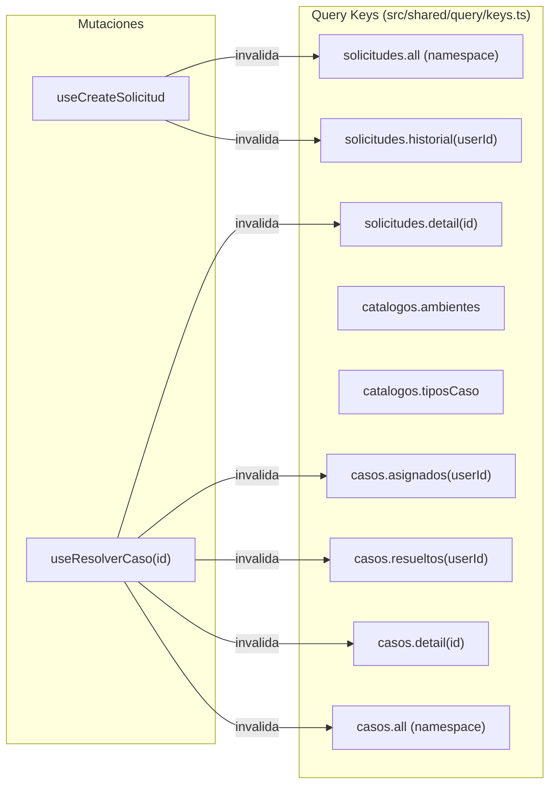

# MiAyudaTIC-Mobile — Context Architecture

> **Versión:** post-Fase 2A · **Última actualización:** 2026-06-14
> **Código fuente inspeccionado directamente.** Donde exista divergencia entre este documento y un handoff anterior, el código manda.

---

## 1. Propósito de este documento

Este archivo es la fuente de verdad arquitectónica del módulo mobile de MiAyudaTIC. No es un README ni un handoff de fase. Es el documento que un nuevo founding engineer, un staff mobile engineer, o un agente de Cursor debe leer antes de tocar cualquier cosa.

**Qué contiene:**
- Arquitectura real del sistema tal como existe en el código hoy.
- Decisiones ya tomadas y por qué se tomaron así.
- Invariantes que no deben romperse.
- Deuda técnica aceptada explícitamente.
- Riesgos activos con contexto.
- Reglas de operación para la siguiente fase.

**Cómo mantenerlo vivo:**
- Actualizar al cierre de cada fase (antes de crear el handoff de fase).
- Si un hotfix modifica una decisión arquitectónica, actualizar la sección correspondiente el mismo día.
- No usar este archivo para documentar scope de feature; para eso existen los handoffs por fase (`mobile-phase-N-handoff.md`).
- Si el código contradice algo aquí escrito, el código manda y este archivo debe corregirse.

**Archivos relacionados:**
- `mobile-phases.md` — roadmap 0–6, operating model, definición de "done"
- `mobile-phase-0-handoff.md` — histórico de Fase 0 (parcialmente stale, ver §8)
- `mobile-phase-1-handoff.md` — entrega Fase 1
- `mobile-phase-2a-handoff.md` — entrega Fase 2A
- `mobile-phase-2b-handoff.md` — entrega Fase 2B (auth recovery mobile-native)

---

## 2. Estado actual del sistema

### 2.1 Qué fases están completadas

| Fase | Objetivo | Estado técnico | Estado operativo |
|------|----------|----------------|-----------------|
| **0** | Plataforma: auth, sesión, guards, navegación, shells | Cerrado | Cerrado |
| **1** | Primera capa de producto: solicitudes + casos | Cerrado técnicamente | **UI smoke pendiente** |
| **2A** | Profundidad operativa: filtros, timeline, fechas, refresh | Cerrado técnicamente | **Smoke UI 2A pendiente** |
| 2B–6 | Fases futuras | No iniciado | — |

### 2.2 "Cerrado técnicamente" vs "cerrado operativamente"

**Cerrado técnicamente** significa:
- `pnpm typecheck` pasa sin errores.
- `pnpm test` pasa (34 tests).
- Smoke API corre contra Render y devuelve 9/9 PASS.
- No hay regresiones conocidas en plataforma.

**Cerrado operativamente** significa lo anterior más:
- Checklist de smoke UI manual completado y firmado.
- Cualquier decisión de producto abierta fue resuelta o explícitamente diferida.

**Fase 1 está técnicamente cerrada pero no operativamente cerrada.** El checklist manual en `mobile-phase-1-handoff.md` §7 tiene todos los ítems sin marcar. La validación con el emulador aún está pendiente.

### 2.3 Qué validaciones están hechas

| Validación | Estado | Notas |
|------------|--------|-------|
| `pnpm typecheck` | **Confirmado** | Sin errores TS |
| `pnpm test` (38 tests) | **Confirmado** | Vitest node env — re-ejecutado 2026-06-14 post-Fase 2A |
| Smoke API contra Render | **Confirmado** | 9/9 endpoints PASS |
| Smoke UI manual | **Pendiente** | Checklist sin firmar |
| E2E / component tests | **No existe** | No hay Detox ni Testing Library RN |

---

## 3. Arquitectura de la plataforma

### 3.1 Stack y dependencias clave

| Tecnología | Versión | Rol |
|-----------|---------|-----|
| Expo SDK | `~56.0.11` | Runtime y build |
| React Native | `0.85.3` | UI layer |
| React | `19.2.3` | Core UI |
| Expo Router | `~56.2.10` | File-based routing con typed routes |
| TypeScript | `~6.0.3` (strict) | Tipado estático |
| TanStack Query | `^5.101.0` | Data fetching + cache |
| Zod | `^4.3.6` | Validación de schemas |
| react-hook-form | `^7.56.4` | Formularios |
| Vitest | `^4.1.8` | Test runner (node env) |
| expo-secure-store | `~56.0.4` | Token JWT en keychain |
| expo-image-picker | `~56.0.17` | Foto en solicitudes y evidencia |
| pnpm | **11.5.0** | Gestor de paquetes (README dice ≥9; incorrecto) |
| Node | `>=20` | Runtime build |

El proyecto está **fuera del workspace pnpm del monorepo**. Instalar con:
```bash
cd mobile/MiAyudaTIC-Mobile
pnpm install --ignore-workspace
```

### 3.2 Árbol de providers raíz

```
app/_layout.tsx
└── SafeAreaProvider
    └── QueryClientProvider  (src/shared/query/client.ts — staleTime 30s, retry 1)
        └── AuthProvider     (src/features/auth/auth-context.tsx)
            └── RootNavigator
                └── Stack
                    ├── index              (AppGate, público)
                    ├── (auth)             (público)
                    ├── restablecerPassword/[token]  (público)
                    ├── Stack.Protected (funcionario)  guard=canAccessFuncionarioStack
                    └── Stack.Protected (tecnico)      guard=canAccessTecnicoStack
```

Ningún provider depende de otro en sentido inverso. El orden importa: `QueryClient` debe montarse antes que `AuthProvider` porque los hooks de TanStack Query se usan dentro del contexto de auth.

### 3.3 AppGate — primer decisor de destino

`app/index.tsx` es el único punto donde se decide el destino inicial de la app tras el bootstrap. No hace fetch, no tiene lógica de negocio. Consume `useAppBootstrap()` (`src/shared/hooks/useAppBootstrap.ts`) y emite un `<Redirect>` o muestra estado de carga/error.

El flujo real verificado en código:
1. Obtiene `access: AccessResolution` de `useAppBootstrap()`.
2. Llama `destination = getRouteForAccess(access)` — retorna `Href | null`.
3. Si `isBootstrapping` → `<FullScreenLoader>`.
4. Si `isRestoreFailed` → `<ErrorState>` + botón "Reintentar" + botón "Volver al inicio".
5. Si `destination !== null` → `<Redirect href={destination} />`.
6. Si `destination === null` (estado `guest`) → pantalla welcome con botones login/registro.

```
SessionStatus.bootstrapping  → <FullScreenLoader>
SessionStatus.restore_failed → <ErrorState> + Reintentar (token conservado)
SessionStatus.guest          → destination=null → welcome screen
SessionStatus.access_blocked → access=lider_blocked|pending_approval → destination → <Redirect>
SessionStatus.authenticated  → access=allow_funcionario|allow_tecnico → destination → <Redirect>
SessionStatus.expired        → access=expired → destination='/(auth)/session-expired' → <Redirect>
```

**Nota:** `access_blocked` no es manejado directamente en AppGate. El flujo pasa por `resolveMobileAccess` (en `AuthProvider`) que transforma `access_blocked` en `lider_blocked` o `pending_approval`, y luego `getRouteForAccess` los mapea a rutas. `navigateForAccess` es solo para navegación imperativa post-login/register, **no** se usa en AppGate.

**Regla crítica:** AppGate no debe adquirir lógica propia. Toda decisión de routing vive en `guards.ts`. `navigation.ts` es para navegación imperativa post-acción, no para bootstrap.

**Contrato P0 (navegación vs montaje) — no negociable:**

| Responsabilidad | Dueño | Qué no hacer |
|-----------------|-------|----------------|
| Destino `guest` (Welcome / Login) | **Solo AppGate** (`app/index.tsx`). `getRouteForAccess(guest)` es `null` → Welcome, sin `<Redirect>`. | Que layouts de rol, OverflowMenu o logout emitan `router.replace('/')` / `<Redirect href="/" />`. |
| Montaje / desmontaje de stacks de rol | **`Stack.Protected`** en `app/_layout.tsx`, guard `canAccessFuncionarioStack` / `canAccessTecnicoStack`. Guest, otro rol y `restore_failed` → el grupo no existe en el árbol ni en el historial de Back. | Tratar el layout de rol como dueño del destino guest. |
| Layouts `(funcionario)` / `(tecnico)` | `shouldRenderRoleStack` → **`return null`**. Protegen; no navegan. | `<Redirect>` al pasar a `guest`. Eso compete con AppGate y el navigator. |

**Motivo:** un `<Redirect href="/" />` en el layout de funcionario, con Cuenta aún focused tras `guest`, re-disparaba `router.replace('/')` en cada re-render (`useFocusEffect` de Expo Router Redirect) → **`Maximum update depth`**. Un solo dueño de destino guest + Protected para montaje evita esa competencia.

### 3.4 Sistema de sesión: SessionStatus vs AccessResolution

Estas dos abstracciones están intencionalmente separadas porque resuelven problemas distintos:

**`SessionStatus`** (`src/features/auth/session-types.ts`) — estado de persistencia y arranque:



Los 6 estados válidos (el código tiene 6, no 5 como indica el handoff de Fase 0):
- `bootstrapping` — estado inicial, no renderizar nada de negocio
- `guest` — sin sesión activa
- `authenticated` — sesión activa con `AuthSession` (token + User)
- `expired` — token caducado (401 recibido)
- `restore_failed` — fallo de red en bootstrap (token conservado)
- `access_blocked` — rol no permitido en mobile (líder o técnico pendiente)

**`AccessResolution`** (`src/features/auth/session-types.ts`) — decisión de negocio sobre qué puede hacer el usuario:
- `allow_funcionario` / `allow_tecnico` → acceso al stack de su rol
- `pending_approval` / `lider_blocked` → pantallas de bloqueo
- `guest` / `expired` / `restore_failed` → estados espejo de sesión

La separación existe para que los guards de rol no necesiten conocer por qué un usuario no tiene sesión, y para que `SessionStatus` no acumule lógica de negocio.

### 3.5 Matriz bootstrap (decisiones duras, verificadas en código)

| Evento en bootstrap | Token | `SessionStatus` resultante | Destino UI |
|--------------------|-------|---------------------------|-----------|
| Sin token en SecureStore | — | `guest` | welcome |
| `verify-token` 200 + rol permitido | conservar | `authenticated` | home por rol |
| `verify-token` 200 + líder | **wipe** | `access_blocked` (lider_blocked) | lider-not-supported |
| `verify-token` 200 + técnico no aprobado | **wipe** | `access_blocked` (pending_approval) | pending-approval |
| `verify-token` 401 | **wipe** | `expired` | session-expired |
| `verify-token` 403 | **wipe** | `guest` | welcome |
| `verify-token` red/timeout/5xx | **conservar** | `restore_failed` | ErrorState + Reintentar |
| Error inesperado | **wipe** | `guest` | welcome |

**Regla fundamental:** error de red ≠ sesión expirada. `restore_failed` con token conservado permite al usuario reintentar sin perder la sesión cuando el backend vuelva.

`verify-token` se llama con `notifyUnauthorized: false` para que el handler global de 401 no dispare `markSessionExpired()` en este momento específico; la lógica de expiración en bootstrap es manual y diferente.

### 3.6 Guards y protección de stacks por rol

`src/features/auth/guards.ts` contiene:
- `resolveMobileAccess(session: SessionStatus): AccessResolution` — mapea estado de sesión a decisión de acceso
- `getRouteForAccess(access: AccessResolution): Href | null` — mapea decisión a ruta Expo Router; retorna `null` para `bootstrapping`, `guest`, `restore_failed` (no hay ruta fija para estos estados)
- `canAccessFuncionarioStack(access)` / `canAccessTecnicoStack(access)` — `true` solo con `allow_funcionario` / `allow_tecnico`
- `isPublicAuthRoute(segment: string): boolean` — exportada pero **no consumida por ningún layout** (dead export; el layout de auth duplica la lista internamente)

**Montaje (quién puede existir en el árbol):** `app/_layout.tsx` envuelve `(funcionario)` y `(tecnico)` en `Stack.Protected`. Si el guard es falso, Expo Router **no monta** ese grupo: no hay frame de contenido de rol, y el historial de esas rutas no queda para Back. Eso es independiente de AppGate: Protected no elige Welcome; solo decide si el stack de rol existe.

**Protección local (no competir con AppGate):** `shouldRenderRoleStack` en `src/features/auth/role-layout-policy.ts`. Los layouts `app/(funcionario)/_layout.tsx` y `app/(tecnico)/_layout.tsx` hacen `return null` si el stack no corresponde. **No** `<Redirect>` al pasar a `guest`.

**Auth group:** `app/(auth)/_layout.tsx` — usuario autenticado en login/register → redirect al home de su rol; `expired` → `session-expired`. Guest en auth (login) es válido.

**Por qué cambió (P0):** un `<Redirect href="/" />` en el layout de funcionario, con Cuenta still focused tras `guest`, disparaba `router.replace('/')` en cada re-render (`useFocusEffect` de Expo Router Redirect) → **`Maximum update depth`**. AppGate es el único dueño del destino guest; Protected monta/desmonta; los layouts de rol no navegan.

Un técnico con `allow_tecnico` no monta el stack funcionario (`canAccessFuncionarioStack === false`). Guest y `restore_failed` tampoco.

**Matriz de guards validada (emulador, 2026-08-22, development build + Metro):**

| Caso | Resultado |
|------|-----------|
| Guest + deep link Inicio / Casos / Cuenta / Nueva solicitud / detalle | Welcome. Sin contenido funcionario, sin RedBox, sin loop |
| Logout desde detalle (Casos → `2026-08-00010` → Cuenta → Cerrar sesión) | Welcome. Back sale de la app; no restaura detalle/Casos/Cuenta/Inicio |
| Re-login tras ese logout | Inicio funcionario. Casos se abre desde cero |
| Guest + `miayudatics://nueva-solicitud` | Welcome. Sin modal residual |
| Técnico aprobado vs Funcionario | Cubierto por tests (`canAccessFuncionarioStack` false). **Deuda no bloqueante:** repetir en dispositivo con técnico aprobado real. |
| `restore_failed` (HTTPS bloqueado, token presente, Metro vivo) | “Sin conexión” + “Tu sesión sigue guardada” + Reintentar. No es logout. Reintentar con red → Inicio. Sin `Maximum update depth` |

**Simular `restore_failed` en emulador (reversible).** Objetivo: token en SecureStore, Metro vivo (`10.0.2.2:8081`), API HTTPS inalcanzable.

```text
# Aplicar (con sesión autenticada; luego force-stop + open:emulator)
adb -s emulator-5554 root
adb -s emulator-5554 shell iptables -I OUTPUT -d 10.0.2.2 -j ACCEPT
adb -s emulator-5554 shell iptables -I OUTPUT -p tcp --dport 8081 -j ACCEPT
adb -s emulator-5554 shell iptables -I OUTPUT -p tcp --dport 443 -j REJECT
adb -s emulator-5554 emu network speed 0

# Revertir al perfil default del emulador (ilimitado: speed full / delay none)
adb -s emulator-5554 shell iptables -D OUTPUT -p tcp --dport 443 -j REJECT
adb -s emulator-5554 shell iptables -D OUTPUT -p tcp --dport 8081 -j ACCEPT
adb -s emulator-5554 shell iptables -D OUTPUT -d 10.0.2.2 -j ACCEPT
adb -s emulator-5554 emu network speed full
adb -s emulator-5554 emu network delay none
adb -s emulator-5554 unroot
```

`emu network status` tras `speed full` reporta **0 bits/s**: en esta consola eso es “sin tope”, no enlace muerto. `speed 0` es el throttle del test y se ve igual en el status; hay que revertir siempre con `speed full`.

### 3.6.1 Deuda no bloqueante (P0 cerrado)

No bloquean cierre ni rediseño. No requieren cambio de auth/navegación ahora:

1. Técnico **aprobado real** en dispositivo abriendo una ruta Funcionario (deep link / typing). Hoy solo tests unitarios; no hay cuenta de prueba aprobada en Render.
2. Tap **manual** de imagen **>10 MiB** en DocumentsUI (A30s). Cliente y copy ya cubiertos; el grid del picker no se selecciona de forma fiable por adb.

### 3.7 Política de persistencia (session-policy)

`src/features/auth/session-policy.ts` es la fuente de verdad de qué usuarios pueden tener sesión persistida en mobile. Esta fue la corrección central del hotfix de Fase 0 (ver §8).

Reglas actuales:
- `funcionario` → persiste siempre
- `tecnico` con `isApproved === true` → persiste
- `tecnico` con `isApproved === false` → no persiste, `access_blocked` (pending_approval)
- `lider` → no persiste nunca, `access_blocked` (lider_blocked)

`commitMobileSession(authSession)` en `auth-context.tsx` es el único punto de entrada para persistir una sesión. Lo usan bootstrap, login y register. No existe otra ruta para persistir un token.

### 3.8 Cliente HTTP (apiFetch)

`src/shared/api/client.ts` — responsabilidades:
- Añade `Authorization: Bearer <token>` cuando se provee token.
- Timeout configurable (30s por defecto, definido en `src/shared/config/env.ts`).
- Soporta `FormData` y JSON (detecta por tipo de body).
- En respuesta 401: llama al handler registrado → `markSessionExpired()` en `AuthContext`.
- Mapea errores HTTP a `ApiError` con `code` tipado.

**Qué NO hace `apiFetch`:**
- No navega (solo invoca el handler registrado).
- No conoce roles ni rutas.
- No persiste ni lee tokens.
- No reinteinta automáticamente (TanStack Query maneja `retry: 1`).

La única variable de entorno de red es `EXPO_PUBLIC_API_URL`. No existe configuración diferenciada por entorno (staging/prod) en el código hoy.

`src/shared/api/errors.ts` define `ApiError` con `code`:
- `UNAUTHORIZED` (401), `FORBIDDEN` (403), `NOT_FOUND` (404), `TIMEOUT`, `NETWORK_ERROR`, `SERVER_ERROR`, `UNKNOWN`
- `isRecoverableError()` — red/timeout/5xx → true; auth errors → false

### 3.9 Data layer (TanStack Query)

`QueryClient` configurado en `src/shared/query/client.ts`:
- `staleTime: 30_000` (30s) por defecto
- `retry: 1` — un reintento antes de error

Todos los hooks de negocio siguen este patrón:
```ts
useQuery({
  queryKey: queryKeys.feature.scope(userId),
  queryFn: () => fetchFn(token!),
  enabled: Boolean(token && userId),  // nunca fetcha sin autenticación
})
```

Los catálogos (`ambientes`, `tiposCaso`) tienen `staleTime: 5 * 60 * 1000` (5 min) porque no cambian frecuentemente.

Invalidación tras mutaciones: ver Anexo C.

### 3.10 Contratos y capa anticorrupción

Principio central: **los screens y los hooks nunca tocan DTOs del backend**. Todo objeto que viene de la API pasa por un mapper en `src/shared/contracts/` antes de llegar a la UI.

Mappers implementados:
- `mapUserDto` — `_id`→`id`, `nombre`→`fullName`, `correo`→`email`, `rol`→`role`; `isApproved` tiene lógica diferenciada por rol: para `tecnico` es `dto.estado === true`; para otros roles es `dto.activo !== false && dto.estado !== false`. No es un mapeo simple de `estado`.
- `mapSolicitudSummary` / `mapSolicitudDetail` — normalización completa de solicitudes
- `mapCasoSummary` / `mapCasoDetail` — incluyendo populated fields (solicitud como objeto, no ID)
- `mapAmbiente` / `mapTipoCaso` — catálogos
- `mapSolucionResponse` — resultado de resolver caso

El campo `fecha` del backend se preserva como `createdAtRaw: string` en el dominio. `formatSolicitudDate()` formatea con `Intl.DateTimeFormat('es-CO', ...)` parseando el formato backend `DD-MM-YYYY HH:mm`.

### 3.11 Navegación — rutas, tipado, reglas

Expo Router con `typedRoutes: true` habilitado en `app.json`. Esto impone que las navegaciones dinámicas usen el formato objeto:

```ts
// CORRECTO
router.push({ pathname: '/(funcionario)/solicitud/[id]', params: { id: item.id } });

// INCORRECTO (TS2345)
router.push(`/(funcionario)/solicitud/${item.id}`);
```

Esta distinción fue el origen de los errores de typecheck al cierre de Fase 1 (ver §8).

Deep links configurados:
- `app/(auth)/reset-password/[token].tsx` — ruta canónica
- `app/restablecerPassword/[token].tsx` — alias legacy para compatibilidad con emails existentes

**Fase 2B (auth recovery):** pantallas forgot/reset productizadas con `useForgotPassword` / `useResetPassword`, `AuthFlowPanel`, `PasswordRuleChecklist`. Ver `mobile-phase-2b-handoff.md`.

**Fase 2C (recovery premium):** UX mobile elevada — countdown en éxito, autofocus, typed routes objeto, checklist accesible. Ver `mobile-phase-2c-handoff.md`.

**Android App Links (2026-06):** el correo sigue usando `{CLIENT_URL}/restablecerPassword/{token}`. Con `assetlinks.json` publicado en Vercel, `intentFilters` en `app.json`, `+native-intent.tsx` y parser en `src/shared/linking/parse-reset-link.ts`, Android abre la app nativa cuando el dominio está en estado **verified/always**. La SPA web no cambia. Custom scheme `miayudatics://restablecerPassword/<token>` permanece para smoke/dev. Si la APK se instaló antes del deploy de `assetlinks.json`, reinstalar tras el deploy (ver `MOBILE_DEV.md`). **Pendiente iOS:** Universal Links (AASA + `associatedDomains`).

No hay otros deep links configurados. Push notifications con routing deep link están pendientes (Fase 3).

---

## 4. Mapa de módulos

### 4.1 Capa de plataforma — no tocar sin razón extrema

Estos archivos definen el contrato fundamental del sistema. Un cambio aquí puede romper plataforma completa.

| Archivo | Por qué es plataforma |
|---------|----------------------|
| `app/_layout.tsx` | Provider tree root |
| `app/index.tsx` | AppGate — único decisor de destino inicial |
| `src/features/auth/auth-context.tsx` | Máquina de estados de sesión |
| `src/features/auth/session-types.ts` | Contrato de tipos de sesión |
| `src/features/auth/session-policy.ts` | Reglas de persistencia |
| `src/features/auth/guards.ts` | Lógica de acceso por rol |
| `src/features/auth/navigation.ts` | Única fuente de navegación imperativa |
| `src/shared/api/client.ts` | HTTP client + handler 401 global |
| `src/shared/api/errors.ts` | Normalización de errores |
| `src/shared/query/client.ts` | QueryClient config |
| `src/shared/query/keys.ts` | Query key namespaces |
| `src/shared/storage/token.ts` | JWT SecureStore |
| `src/shared/config/env.ts` | Base URL y timeouts |

### 4.2 Capa de negocio — feature modules

Cada feature module es autónomo: tiene su propio `api.ts`, `hooks.ts`, `schemas.ts` y `components/`. No importa de otros feature modules.

| Feature | Archivos | Consumidores |
|---------|---------|-------------|
| `features/auth/` | api, schemas, types (deprecated) | `app/(auth)/`, `app/_layout.tsx` |
| `features/solicitudes/` | api, hooks, schemas, SolicitudForm | `app/(funcionario)/` |
| `features/casos/` | api, hooks, schemas, ResolverCasoForm | `app/(tecnico)/` |

### 4.3 Capa UX/shared — componentes y contratos

| Subcapa | Archivos | Regla |
|---------|---------|-------|
| Contratos | `src/shared/contracts/*.ts` | Solo tipos de dominio hacia arriba; DTOs solo hacia abajo |
| UI primitivos | `AppButton`, `FormField`, `FormPanel`, `SelectField` | Sin dependencia de negocio |
| UI compuestos | `QueryBoundary`, `RoleHomeShell`, `ScreenScaffold` | Sin fetch directo |
| UI de dominio | `StatusBadge`, `SolicitudListItem`, `CasoListItem` | Consumen tipos de dominio, no DTOs |
| UI auth | `AuthScaffold`, `BrandTitle` | Solo en `(auth)/` |

### 4.4 Scripts y CI

| Artefacto | Ubicación | Estado |
|-----------|----------|--------|
| `smoke-api.sh` | `scripts/` | Funcional, manual, **no en CI** |
| CI `mobile-typecheck` | `.github/workflows/ci.yml` | Corre typecheck + test en push/PR |
| CI post-deploy smoke | `.github/workflows/post-deploy-smoke.yml` | **Solo web/backend, no mobile** |

---

## 5. Invariantes no negociables

Estas reglas no deben romperse. Cualquier cambio que las viole es un bloqueante, no un trade-off.

1. **`commitMobileSession` es el único punto de persistencia.** Login, register y bootstrap deben pasar por él. No persistas token directo en ningún otro lugar.

2. **Error de red ≠ sesión expirada.** `restore_failed` conserva el token. `expired` lo wipe. No confundirlos.

3. **Los screens solo consumen tipos de dominio.** Ningún DTO del backend (`_id`, `nombre`, `correo`, `estado`) debe aparecer en un componente o pantalla.

4. **`apiFetch` no navega, no conoce roles, no persiste.** Si necesitas navegar desde un error de API, regístralo vía `setUnauthorizedHandler` en `AuthContext`. No añadas navegación dentro de `client.ts`.

5. **AppGate es el único dueño del destino guest. `Stack.Protected` monta o desmonta stacks de rol. Los layouts de rol no hacen Redirect a guest.** Evita competencia de navegación y `Maximum update depth`. Los layouts solo `return null` si el stack no corresponde.

6. **`verify-token` siempre con `notifyUnauthorized: false`.** El bootstrap maneja su propia lógica de 401; activar el handler global crearía un loop.

7. **Nuevas rutas solo dentro de stacks existentes.** No crear nuevos grupos de rutas sin justificación arquitectónica explícita. `(funcionario)` y `(tecnico)` son los contenedores de las features de negocio.

8. **Typed routes obligatorias.** Toda navegación a ruta dinámica usa el formato objeto `{ pathname, params }`. Nunca template strings para rutas dinámicas.

9. **`access_blocked` nunca tiene sesión persistida.** Si un usuario llega a `access_blocked`, su token fue wipado antes de llegar ahí.

10. **Los catálogos no se refetchen en cada mount.** `staleTime: 5 min` en ambientes y tiposCaso es intencional para no saturar el backend con datos que no cambian frecuentemente.

---

## 6. Qué se entregó en Fase 0

Fase 0 no construyó features de negocio. Construyó la plataforma sobre la que todo lo demás se ejecuta.

**Decisiones arquitectónicas más importantes:**

- Separación `SessionStatus` / `AccessResolution`: permite que los guards de negocio y los estados de persistencia evolucionen independientemente.
- Bootstrap matrix con `restore_failed`: la app no trata fallas de red como sesión expirada. Esto es crítico para usuarios en campo con conectividad intermitente.
- `commitMobileSession` como único punto de persistencia: eliminó la posibilidad de persistir tokens de líderes o técnicos no aprobados por un camino alternativo.
- `apiFetch` con handler 401 global: cualquier request autenticado que reciba un 401 transiciona automáticamente a `expired`, sin que las pantallas individuales deban manejarlo.
- Typed routes de Expo Router: impone contrato en tiempo de compilación para rutas dinámicas.

**Problema que resolvió:** la versión inicial tenía una política de persistencia asimétrica. Login usaba una lógica, register usaba otra, y bootstrap usaba una tercera. El hotfix de Fase 0 (posterior al scope original) unificó todo en `session-policy.ts` y añadió el estado `access_blocked`.

**Nota sobre el handoff:** `mobile-phase-0-handoff.md` fue escrito antes del hotfix de unificación de sesión y antes de Fase 1. Describe los homes como "shells con CTA de Fase 1" y lista solo 5 estados de `SessionStatus`. Ambas descripciones son históricas; el código actual tiene homes con datos reales y 6 estados.

---

## 7. Qué se entregó en Fase 1

Fase 1 construyó la primera capa operativa real sobre la plataforma de Fase 0. Sin tocar plataforma.

### 7.1 Funcionario

- **Home real:** stats derivadas del historial (total, pendientes, resueltas) + lista de solicitudes recientes
- **Nueva solicitud:** formulario con ambient, tipo, descripción, foto opcional; POST multipart a `/solicitud`
- **Historial completo:** lista paginada en cliente
- **Detalle de solicitud:** pantalla read-only con todos los campos del dominio

Las stats no vienen de un endpoint dedicado. Se derivan en cliente con `computeSolicitudStats()` sobre el array del historial. Esto es deuda aceptada hasta que el backend exponga un endpoint de stats (ver §10).

### 7.2 Técnico

- **Home con tabs:** "Por resolver" (casos asignados, filtrados por `canResolveCaso()`) y "Mis casos" (todos los asignados, sin filtro de estado)
- **Resueltos recientes:** top 5 casos de `/solicitud/finalizadas`, ordenados por fecha
- **Detalle de caso:** pantalla con datos completos + botón "Resolver" que navega a la pantalla de resolución
- **Resolver caso:** formulario con tipo de caso, descripción, tipo de solución, evidencia opcional; POST a `/solucionCaso/:id`

**Nota de implementación:** `useMisCasos` devuelve **todos** los casos asignados ordenados por fecha, no solo los "en progreso". El label "Mis casos" en el handoff sugería filtro de estado, pero el endpoint `/solicitud/asignadas` devuelve todo y no hay estado intermedio claro en el dominio actual.

### 7.3 Infraestructura añadida en Fase 1

- Contratos de dominio: `solicitud.ts`, `caso.ts`, `solucion.ts`, `catalogo.ts` con DTOs, mappers y helpers
- Feature APIs: `solicitudes/api.ts`, `casos/api.ts`
- Hooks TanStack Query por feature con `enabled`, `staleTime` y `onSuccess` invalidation
- Schemas Zod para formularios de negocio
- Componentes UI: `QueryBoundary`, `StatusBadge`, `SolicitudListItem`, `CasoListItem`, `SectionHeader`, `SelectField`, `ScreenScaffold`
- Formularios: `SolicitudForm`, `ResolverCasoForm`
- `scripts/smoke-api.sh` funcional contra Render

---

## 8. Hotfixes y correcciones de cierre técnico

### HF-01: Unificación de política de sesión (Fase 0 tardío)

**Qué:** La política de qué usuarios podían persistir token era asimétrica entre bootstrap, login y register.

**Fix:** Se creó `src/features/auth/session-policy.ts` con `resolveMobilePersistDecision()` y se reemplazó `establishPermittedSession` por `commitMobileSession` en `auth-context.tsx`. Se añadió `access_blocked` como sexto estado de `SessionStatus`.

**Por qué importa arquitectónicamente:** Sin este fix, era posible que un líder o técnico pendiente terminara con sesión persistida por un camino alternativo (p.ej. register funcionario que se convirtió en técnico después). Ahora es imposible por construcción.

### HF-02: Typed routes de Expo Router (cierre técnico Fase 1)

**Qué:** Todos los `router.push(\`/(role)/screen/${id}\`)` con template strings generaban `TS2345` porque Expo Router con `typedRoutes: true` no acepta template strings para rutas dinámicas.

**Fix:** Se reemplazaron por `router.push({ pathname: '/(role)/screen/[id]', params: { id } })` en todos los archivos de pantalla y en `auth/navigation.ts`.

**Por qué importa arquitectónicamente:** Es una garantía de compilación. Si una ruta dinámica cambia de nombre, el compilador detecta el error inmediatamente en lugar de fallar en runtime.

### HF-03: Import faltante de `User` en auth-context (regresión Fase 1)

**Qué:** La refactorización de Fase 1 eliminó accidentalmente `import type { User } from '@/shared/contracts/user'` de `auth-context.tsx`, causando `TS2304`.

**Fix:** Re-añadir el import.

**Por qué importa:** Es un recordatorio de que `auth-context.tsx` tiene dependencias de tipo de `shared/contracts` que no son obvias a primera vista. Al editar este archivo, verificar siempre los imports de tipo.

---

## 9. Estado de validación actual

| Validación | Estado | Detalles |
|-----------|--------|---------|
| `pnpm typecheck` | **PASS** ¹ | `tsc --noEmit` sin errores al cierre de Fase 1 |
| `pnpm test` | **PASS** ¹ | 34 tests, Vitest `^4.1.8`, node env |
| CI `mobile-typecheck` | **Activo** | Job en `.github/workflows/ci.yml`; corre typecheck + test en push/PR |
| Smoke API (Render) | **PASS** ¹ | 9/9: login ×3 roles, historial, catálogos ×2, asignadas, finalizadas, 401 — script: `scripts/smoke-api.sh` |
| Smoke UI manual | **PENDIENTE** | Checklist completo en `mobile-phase-1-handoff.md` §7, todos `[ ]` sin marcar |
| E2E / component tests | **NO EXISTE** | Sin Detox, sin Testing Library RN; `expo-notifications` no en dependencias |
| Post-deploy CI smoke | **NO APLICA** | `.github/workflows/post-deploy-smoke.yml` solo cubre web/backend |

> ¹ Verificado al cierre de la sesión de Fase 1 (2026-06-14). No re-ejecutado en esta auditoría. Para confirmar estado actual: `cd mobile/MiAyudaTIC-Mobile && pnpm install --ignore-workspace && pnpm typecheck && pnpm test`.

**Cobertura de tests unitarios (lo que tienen tests):**
- Contratos: `user`, `solicitud`, `caso`, `catalogo` — mappers y helpers
- Auth: `guards`, `session-policy`
- API: `errors` — normalización

**Sin cobertura:**
- Hooks (TanStack Query mocking)
- API functions
- Screens y forms
- Navegación
- Image upload

---

## 10. Deuda técnica aceptada y pendientes reales

Estas deudas son conocidas, aceptadas conscientemente y no deben confundirse con bugs.

| Deuda | Impacto | Fase sugerida |
|-------|---------|--------------|
| Stats de funcionario derivadas en cliente | N+1 implícito (carga historial completo para derivar stats) | Fase 2 (endpoint dedicado) |
| `formatSolicitudDate()` devuelve raw string del backend | **Resuelto en 2A** | Locale `es-CO` |
| `useMisCasos` = todos los asignados | **Resuelto en 2A** | `filterCasosEnProgreso`; tab renombrado "En progreso" |
| `defaultCaseTypeId=""` en resolver | **Parcialmente resuelto en 2A** | Pre-fill vía navigation params desde lista; detalle sin `tipoCaso` del backend |
| Sin paginación server-side | Listas completas en memoria | Fase 4 |
| `useCasosResueltosCompletos` exportado pero sin uso | Dead export en `casos/hooks.ts` | Limpiar en 2B |
| `isPublicAuthRoute` exportado pero sin uso | Dead export en `guards.ts` | Limpiar en 2B |
| `getSessionSnapshot` escrito y borrado pero nunca leído | Dead read en `storage/session.ts` | Evaluar eliminar en 2B |
| Push notifications = stubs vacíos + device token vacío | `registerDeviceForPush('', authToken)` — primer arg es `''`; incluso si se implementa el stub, faltaría el FCM/APNs token real | Fase 3 |
| Sin `.env` diferenciado por entorno | Un solo `EXPO_PUBLIC_API_URL`; sin staging/prod config | Antes de Fase 3 |
| README.md dice pnpm ≥9 | Confusión en onboarding; package.json requiere 11.5.0 | Fix inmediato (1 línea) |
| Sin E2E ni component tests | Cobertura limitada a lógica pura | Fase 4 |
| PNG assets (icon, splash, etc.) posiblemente ausentes del repo | `app/index.tsx` hace `require('../assets/icons/sena-verde.png')`; si el PNG no está en el repo, fresh clone falla el bundle | Verificar antes de próxima fase |
| `auth/types.ts` es un shim deprecated | Crea confusión; solo re-exporta tipos de `session-types.ts` | Eliminar en Fase 2 |

---

## 11. Riesgos activos

### RIESGO-01: Variabilidad en respuestas del backend (severidad: media)

El backend puede devolver campos poblados (objetos) o IDs simples dependiendo de la ruta y la versión. Los mappers en `shared/contracts/` absorben esta variabilidad, pero cualquier cambio en el schema de respuesta requiere actualizar los mappers. Sin tests de integración, estos cambios pueden pasar desapercibidos hasta que un screen rompe en runtime.

**Mitigación actual:** Mappers explícitos con tipos estrictos. Si el DTO no matchea, TypeScript lo detecta en compilación, no en runtime — siempre que los DTOs estén correctamente tipados.

### RIESGO-02: Push notifications sin implementar (severidad: baja ahora, alta en Fase 3)

`registerDeviceForPush` y `unregisterDeviceForPush` son funciones completamente vacías (cuerpo vacío, sin código). `commitMobileSession` llama `void registerDeviceForPush('', authSession.token)` — el primer argumento (device token FCM/APNs) es `''` (string vacío). Esto significa que cuando se implemente push en Fase 3:
1. La firma de `registerDeviceForPush` necesita revisarse — actualmente es `(_token: string, _authToken: string)` donde el primer param es el device token y el segundo es el auth token.
2. Se deberá obtener el FCM/APNs token real (via `expo-notifications`) antes de llamar al registro.
3. No hay expo-notifications en las dependencias actuales.

**Mitigación:** Documentado explícitamente. No cerrar Fase 3 sin verificar el endpoint de device tokens en el backend y añadir `expo-notifications` como dependencia.

### RIESGO-03: Sin configuración de entorno diferenciada (severidad: media)

Solo existe `EXPO_PUBLIC_API_URL`. No hay forma de apuntar a staging vs producción sin recompilación. Para un equipo con pipeline CI/CD real, esto es un bloqueante antes de Fase 3.

### RIESGO-04: Checklist UI sin validar (severidad: baja para plataforma, real para producto)

La app compila y los contratos están validados por tests. Pero nadie ha verificado en un dispositivo real que el flujo completo funciona end-to-end. Podría haber bugs de UX, errores de formato de datos, o comportamientos inesperados del backend que solo aparecen en runtime.

### RIESGO-05: Resolver caso no pre-llena tipoCaso (severidad: baja)

`app/(tecnico)/caso/[id]/resolver.tsx` pasa `defaultCaseTypeId=""` a `ResolverCasoForm`. El técnico debe seleccionar el tipo de caso manualmente aunque el caso ya tenga uno asignado. Puede causar inconsistencias si el técnico selecciona un tipo diferente al original.

### RIESGO-06: Offline sin soporte (severidad: media para usuarios en campo)

Los técnicos trabajan frecuentemente en ambientes con conectividad limitada. Hoy la app solo tiene `ErrorState` con botón de reintento. No hay cache persistida, no hay cola de mutaciones offline, no hay indicador de estado de red. Esto es limitante pero aceptado para Fase 1.

---

## 12. Cómo debe trabajar una siguiente fase

### 12.1 Secuencia correcta

1. **Leer este documento** antes de escribir una línea de código.
2. **Leer `mobile-phases.md`** para el scope de la fase específica.
3. **Cerrar validaciones pendientes de Fase 1** (smoke UI manual) antes de iniciar Fase 2.
4. **Declarar invariantes explícitamente** al inicio: qué no se puede tocar y por qué.
5. **Contratos primero:** si la fase necesita nuevos datos del backend, definir los DTOs, mappers y tipos de dominio antes de escribir pantallas.
6. **Feature module aislado:** nuevas features van en su propio módulo en `src/features/`; no mezclan responsabilidades con otros features.
7. **Hooks antes que pantallas:** implementar y verificar los hooks de TanStack Query antes de construir las pantallas que los consumen.
8. **Cerrar con typecheck + tests + smoke** antes de declarar la fase como técnicamente cerrada.
9. **Smoke UI manual** antes de declarar cierre operativo.
10. **Actualizar este documento** antes de crear el handoff de fase.

### 12.2 Cómo distinguir nueva fase vs hotfix

Un **hotfix** aplica cuando:
- Hay un bug en código existente que no fue detectado en QA.
- Hay un error de compilación o test fallido.
- Hay una regresión de plataforma.
- El fix no requiere nuevos contratos ni nuevas pantallas.

Una **nueva fase** aplica cuando:
- Se añade funcionalidad que no existía.
- Se modifica el scope de un feature existente.
- Se necesitan nuevas rutas, nuevos contratos, o nuevos endpoints.

Un hotfix que descubra un problema arquitectónico (como HF-01) puede requerir cambios de plataforma, pero solo en la medida estrictamente necesaria para corregir el bug, sin añadir scope nuevo.

### 12.3 Qué no reabrir salvo necesidad extrema

- La máquina de estados de sesión (`SessionStatus`, `commitMobileSession`, la matriz bootstrap).
- El handler global de 401 en `apiFetch`.
- Los guards de stack por rol.
- El árbol de providers en `app/_layout.tsx`.
- El sistema de typed routes.
- Los query keys existentes (añadir sí; renombrar o reestructurar no, porque invalida la caché de usuarios activos).

Si una fase requiere modificar alguno de estos, debe documentarse la razón, evaluarse el riesgo de regresión, y verificarse con tests de guards/session-policy antes de proceder.

---

## 13. Checklist para agentes y engineers

### Antes de tocar código

- [ ] Leí `mobile-context-architecture.md` (este archivo) completo.
- [ ] Leí `mobile-phases.md` sección de la fase actual.
- [ ] Conozco qué estados de `SessionStatus` existen y qué significa cada uno.
- [ ] Sé qué archivos son capa de plataforma y cuáles son capa de negocio.
- [ ] Si voy a crear contratos nuevos, verifiqué que los DTOs coinciden con `current-web-backend-behavior-v2.md`.
- [ ] Si voy a añadir rutas, confirmé que van dentro de un stack de rol existente.
- [ ] Si voy a añadir query keys, seguí el patrón de namespacing de `src/shared/query/keys.ts`.

### Antes de cerrar una fase

- [ ] `pnpm typecheck` pasa sin errores.
- [ ] `pnpm test` pasa sin errores ni skips.
- [ ] Smoke API corre contra Render y todos los endpoints nuevos pasan.
- [ ] No hay DTOs del backend visibles en ninguna pantalla.
- [ ] No hay navegaciones con template strings a rutas dinámicas.
- [ ] Invariantes de §5 siguen en pie.
- [ ] Los handoffs de fases anteriores no fueron modificados (son históricos).
- [ ] Este documento (`mobile-context-architecture.md`) fue actualizado.
- [ ] Se creó `mobile-phase-N-handoff.md` con el scope entregado.

### Antes de declarar "done"

- [ ] Smoke UI manual completado y firmado (checklist en el handoff de fase).
- [ ] Decisiones de producto de la fase resueltas o diferidas con justificación.
- [ ] Deuda técnica nueva añadida a §10 de este documento.
- [ ] Riesgos nuevos añadidos a §11 de este documento.
- [ ] `mobile-phases.md` actualizado si el estado de la fase cambió.

---

## 14. Discrepancias y nivel de confianza

Esta sección registra afirmaciones auditadas, su grado de confianza y la fuente de verificación. Se actualiza con cada auditoría del documento.

**Auditoría:** 2026-06-14 · Método: lectura directa de código fuente.

| # | Afirmación | Estado | Fuente de verificación | Acción sugerida |
|---|-----------|--------|----------------------|----------------|
| 1 | `SessionStatus` tiene 6 estados incluyendo `access_blocked` | **Verificado en código** | `src/features/auth/session-types.ts` lines 8-14 | — |
| 2 | Bootstrap: 403 → `guest` (no `expired`) | **Verificado en código** | `auth-context.tsx` lines 157-160: `isForbiddenError` → `wipeSession` + `guest` | — |
| 3 | Bootstrap: red/timeout → `restore_failed` sin wipe de token | **Verificado en código** | `auth-context.tsx` lines 163-166: no `wipeSession()` antes de `restore_failed` | — |
| 4 | `commitMobileSession` es el único punto de persistencia | **Verificado en código** | Solo aparece en `auth-context.tsx`; `login`, `register`, `bootstrapSession` lo invocan | — |
| 5 | Todos los requests de auth usan `notifyUnauthorized: false` | **Verificado en código** | `features/auth/api.ts` — los 5 endpoints lo tienen explícitamente | — |
| 6 | AppGate usa `getRouteForAccess` + `<Redirect>`, no `navigateForAccess` | **Verificado en código** | `app/index.tsx` lines 18, 45-47 | Corrección aplicada en §3.3 |
| 7 | `getRouteForAccess` retorna `Href \| null` | **Verificado en código** | `guards.ts` line 50: `Href \| null`; `null` para guest/bootstrapping/restore_failed | Corrección aplicada en §3.6 |
| 8 | `isApproved` en `mapUserDto` es lógica diferenciada por rol | **Verificado en código** | `contracts/user.ts` lines 40-43: `tecnico` usa `estado === true`; otros usan `activo !== false && estado !== false` | Corrección aplicada en §3.10 |
| 9 | `useCreateSolicitud` invalida `solicitudes.all` + `historial` | **Verificado en código** | `solicitudes/hooks.ts` lines 79-84: dos `invalidateQueries` explícitos | Corrección aplicada en Anexo C |
| 10 | `registerDeviceForPush` llamado con `''` como device token | **Verificado en código** | `auth-context.tsx` line 125: `registerDeviceForPush('', authSession.token)` | Añadido a §10 y §11 RIESGO-02 |
| 11 | `isPublicAuthRoute` exportada pero sin consumidor | **Verificado en código** | `guards.ts` line 97; `grep` no encontró imports en ningún otro archivo | Añadido a §10 |
| 12 | `getSessionSnapshot` no se lee en ningún lugar | **Verificado en código** | `grep getSessionSnapshot` → único resultado es la definición en `storage/session.ts` | Confirmado como dead read |
| 13 | `useCasosResueltosCompletos` exportada sin uso | **Verificado en código** | Definida en `casos/hooks.ts` lines 60-70; no aparece en ningún import | Confirmado como dead export |
| 14 | `pnpm typecheck` PASS al cierre de Fase 1 | **Verificado en sesión anterior** (no re-ejecutado en esta auditoría) | Reportado en sesión de cierre de Fase 1 | Re-ejecutar antes de iniciar Fase 2 |
| 15 | `pnpm test` 38 tests PASS | **Verificado en código** (2026-06-14) | Incluye helpers 2A |
| 16 | Smoke API 9/9 PASS en Render | **Verificado en sesión anterior** (no re-ejecutado) | Reportado en sesión de cierre de Fase 1 via `scripts/smoke-api.sh` | Re-ejecutar contra Render antes de Fase 2 |
| 17 | PNG assets presentes en repo | **No verificado** | `app/index.tsx` usa `require('../assets/icons/sena-verde.png')` — los archivos no fueron encontrados en inventario inicial del explore agent | Verificar con `ls assets/icons/` en entorno limpio |
| 18 | `expo-notifications` ausente de dependencias | **Verificado en código** | `package.json` devDependencies + dependencies — no figura | Confirma que push requiere dependencia nueva en Fase 3 |
| 19 | CI `mobile-typecheck` activo | **Verificado en documento** | `.github/workflows/ci.yml` según explore agent | No leído directamente en esta auditoría; confianza alta |
| 20 | `auth/types.ts` es shim deprecated | **Inferido** | Explore agent reporta "deprecated re-exports"; no leído directamente | Leer antes de eliminar en Fase 2 |

---

## 15. Anexos

### Anexo A: Tabla de archivos clave con ownership conceptual

| Archivo | Capa | Ownership conceptual |
|---------|------|---------------------|
| `app/_layout.tsx` | Plataforma | Mobile Infra |
| `app/index.tsx` | Plataforma | Mobile Infra |
| `app/(auth)/_layout.tsx` | Plataforma | Mobile Infra |
| `app/(funcionario)/_layout.tsx` | Plataforma | Product Eng |
| `app/(tecnico)/_layout.tsx` | Plataforma | Product Eng |
| `app/(auth)/login.tsx` | Negocio | Product Eng |
| `app/(auth)/register.tsx` | Negocio | Product Eng |
| `app/(funcionario)/home.tsx` | Negocio | Product Eng |
| `app/(funcionario)/nueva-solicitud.tsx` | Negocio | Product Eng |
| `app/(funcionario)/historial.tsx` | Negocio | Product Eng |
| `app/(funcionario)/solicitud/[id].tsx` | Negocio | Product Eng |
| `app/(tecnico)/home.tsx` | Negocio | Product Eng |
| `app/(tecnico)/caso/[id].tsx` | Negocio | Product Eng |
| `app/(tecnico)/caso/[id]/resolver.tsx` | Negocio | Product Eng |
| `src/features/auth/auth-context.tsx` | Plataforma | Mobile Infra |
| `src/features/auth/session-types.ts` | Plataforma | Mobile Infra |
| `src/features/auth/session-policy.ts` | Plataforma | Mobile Infra |
| `src/features/auth/guards.ts` | Plataforma | Mobile Infra |
| `src/features/auth/navigation.ts` | Plataforma | Mobile Infra |
| `src/features/auth/api.ts` | Negocio | Product Eng |
| `src/features/solicitudes/api.ts` | Negocio | Product Eng II |
| `src/features/solicitudes/hooks.ts` | Negocio | Product Eng II |
| `src/features/solicitudes/schemas.ts` | Negocio | Product Eng II |
| `src/features/solicitudes/components/SolicitudForm.tsx` | UX | Design Eng |
| `src/features/casos/api.ts` | Negocio | Product Eng II |
| `src/features/casos/hooks.ts` | Negocio | Product Eng II |
| `src/features/casos/schemas.ts` | Negocio | Product Eng II |
| `src/features/casos/components/ResolverCasoForm.tsx` | UX | Design Eng |
| `src/shared/api/client.ts` | Plataforma | Mobile Infra |
| `src/shared/api/errors.ts` | Plataforma | Mobile Infra |
| `src/shared/contracts/user.ts` | Plataforma | Product Eng II |
| `src/shared/contracts/auth.ts` | Plataforma | Product Eng II |
| `src/shared/contracts/solicitud.ts` | Negocio | Product Eng II |
| `src/shared/contracts/caso.ts` | Negocio | Product Eng II |
| `src/shared/contracts/catalogo.ts` | Negocio | Product Eng II |
| `src/shared/query/client.ts` | Plataforma | Mobile Infra |
| `src/shared/query/keys.ts` | Plataforma | Product Eng II |
| `src/shared/storage/token.ts` | Plataforma | Mobile Infra |
| `src/shared/storage/session.ts` | Plataforma | Mobile Infra |
| `src/shared/notifications/index.ts` | Plataforma (stub) | Mobile Infra |
| `src/shared/ui/QueryBoundary.tsx` | UX | Design Eng |
| `src/shared/ui/StatusBadge.tsx` | UX | Design Eng |
| `src/shared/ui/RoleHomeShell.tsx` | UX | Design Eng |
| `scripts/smoke-api.sh` | Ops | AI/Ops Eng |

### Anexo B: Mapa de rutas Expo Router



**Grupos protegidos:**
- `(auth)` — redirige usuarios autenticados que intenten ir a login/register
- `(funcionario)` — solo `allow_funcionario`
- `(tecnico)` — solo `allow_tecnico`

### Anexo C: Query keys e invalidaciones



**staleTime:**
- Default global: 30 segundos
- `catalogos.ambientes`: 5 minutos
- `catalogos.tiposCaso`: 5 minutos

**Nota:** `useCasosPorResolver` y `useMisCasos` son derivados de `useCasosAsignados` vía `useMemo`. Comparten el mismo query key y se actualizan automáticamente cuando `casos.asignados` se invalida.

### Anexo D: Decisiones de producto abiertas

Estas decisiones no tienen respuesta confirmada y afectan implementación futura. No cerrar fases que las impliquen sin resolverlas primero.

| Decisión | Contexto | Impacto si se decide X |
|----------|---------|----------------------|
| Técnico recién aprobado: ¿notificación + deep link automático? | Hoy debe volver a login manualmente | Requiere Fase 3 (push real) |
| Líder en mobile: ¿roadmap o permanentemente web only? | Bloqueado por `lider_blocked`; Fase 6 en roadmap | Si permanentemente web: simplificar guards y eliminar `lider_blocked` |
| `REQUIRE_SOLICITUD_FOTO=true`: ¿se valida en mobile? | Backend tiene flag de env; schema mobile no lo evalúa | Requiere schema condicional en `solicitudes/schemas.ts` |
| Evidencia en resolución: ¿obligatoria en mobile? | Hoy opcional; web no la sube | Si obligatoria: modificar `resolveCasoSchema` |
| Paginación: ¿server-side o cursor-based? | Hoy sin paginación | Afecta query keys, hooks y contratos de Fase 4 |
| Stats dedicadas de funcionario: ¿endpoint backend? | Hoy derivadas en cliente | Si hay endpoint: nuevo contrato + hook en Fase 2 |
| Multi-entorno: ¿cómo se gestiona staging vs producción? | Hoy un solo `EXPO_PUBLIC_API_URL` | Requiere EAS Build con channel/profile antes de Fase 3 |

---

*Este documento debe actualizarse al cierre de cada fase y cuando un hotfix modifique decisiones arquitectónicas documentadas aquí.*
*Si encuentras una discrepancia entre este documento y el código, el código manda. Corrige el documento.*
